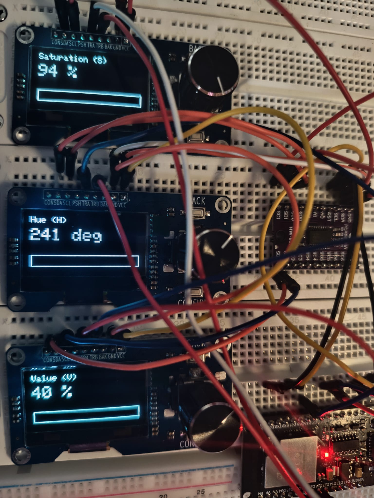
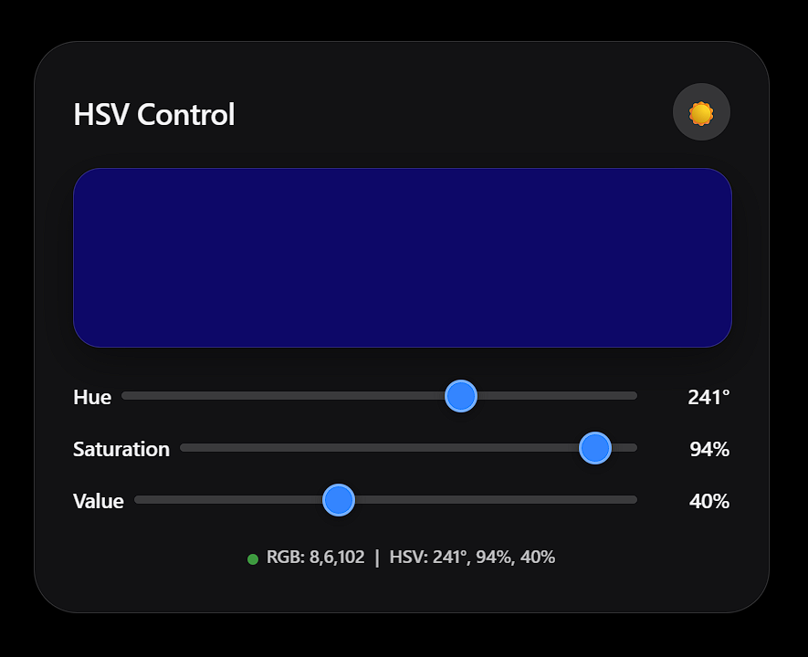

# 项目目标

这是比较重要的一个测试，通过多路复用器可以节省很多引脚，避免引脚不够用的问题。第一版原型验证了一块 ESP32 同时带两个编码器和两块 OLED 没问题，这一版从两路扩到三路，还给每个模块派了正经任务：H、S、V。一块 ESP32、一颗 TCA9548A、三块 SH1106 OLED、三个 EC11 编码器，再加一个实时预览颜色、和旋钮双向同步的 WiFi 网页。

系统要做四件事：

1. **三块 OLED 各显示一个 HSV 通道**：H（色相）、S（饱和度）、V（明度），都带一条当前颜色的进度条。
2. **三个编码器各调一个通道**：拧旋钮，数值和进度条一起变。
3. **网页实时预览颜色**，和硬件双向同步。
4. **给 NeoPixel 留好接口**：刷新路径已经铺好，灯带可以直接挂在同一份 HSV 状态上。

三个核心难点：

1. **三块 OLED 的 I2C 地址都是 0x3C**，没法直接并联。
2. **三个编码器要占 6 个 GPIO**，引脚预算得控制住。
3. **WiFi 射频会干扰 I2C**，发射瞬间的电流冲击还会让板子复位。

# 硬件清单

| 组件 | 数量 | 说明 |
|---|---|---|
| ESP32 开发板 | 1 | 本文用 ESP32-D0WD-V3 |
| TCA9548A I2C 多路复用器 | 1 | 默认地址 0x70 |
| 1.3 寸 OLED + EC11 一体化模块 | 3 | 驱动芯片是 SH1106，SSD1306 库不认 |
| 杜邦线 | 若干 | 短而粗的比长而细的稳 |
| 5V 2A 电源适配器 | 1 | 不要用电脑 USB 口供电 |

> 提醒：1.3 寸 OLED 几乎都是 SH1106，只有 0.96 寸的才是 SSD1306。库用错就是白屏加偶尔闪一行黑字。

# 接线

## 一体化模块的 9 个引脚，分两组

OLED 侧（4 针，I2C）：

| 丝印 | 含义 | 接法 |
|---|---|---|
| VCC | 电源正 | 接 3.3V |
| GND | 电源地 | 接 GND |
| SDA | I2C 数据 | 走 TCA9548A 通道 |
| SCL | I2C 时钟 | 走 TCA9548A 通道 |

编码器侧（5 针，机械开关）：

| 丝印 | 含义 | 接法 |
|---|---|---|
| TRA | A 相 | 接 ESP32 GPIO |
| TRB | B 相 | 接 ESP32 GPIO |
| CON | 公共端 | 模块内部已上拉，可悬空 |
| PSH | 按键一端 | 不用可悬空 |
| BAK | 按键另一端 | 不用可悬空 |

> 我手上的模块内部把 CON/BAK 上拉到了 3.3V，什么都不接就能用。如果你的模块悬空 CON 转不动，把 CON 接到 GND。

## ESP32 ↔ TCA9548A

| ESP32 | TCA9548A | 说明 |
|---|---|---|
| GPIO 21 | SDA | 主 I2C 数据 |
| GPIO 22 | SCL | 主 I2C 时钟 |
| 3.3V | VIN | 供电 |
| GND | GND | 共地 |
| 悬空 | RST | 可以悬空，我就是悬空的 |

> 关于 RST：低电平有效复位，多数模块内部有上拉，悬空就能工作。

## TCA9548A ↔ 三块 OLED

| 模块 | OLED SDA | OLED SCL |
|---|---|---|
| 模块 1 | SD0 | SC0 |
| 模块 2 | SD1 | SC1 |
| 模块 3 | SD2 | SC2 |

每块模块 VCC 接 3.3V，GND 接 GND。

## ESP32 ↔ 三个编码器

| 模块 | TRA | TRB | CON | PSH | BAK |
|---|---|---|---|---|---|
| 模块 1 | GPIO 25 | GPIO 18 | 悬空 | 悬空 | 悬空 |
| 模块 2 | GPIO 26 | GPIO 27 | 悬空 | 悬空 | 悬空 |
| 模块 3 | GPIO 4 | GPIO 16 | 悬空 | 悬空 | 悬空 |

## 引脚占用

| 用途 | GPIO | 数量 |
|---|---|---|
| I2C（SDA/SCL） | 21, 22 | 2 |
| 模块 1 编码器 | TRA→GPIO 25，TRB→GPIO 18 | 2 |
| 模块 2 编码器 | TRA→GPIO 26，TRB→GPIO 27 | 2 |
| 模块 3 编码器 | TRA→GPIO 4，TRB→GPIO 16 | 2 |
| 合计 | | 8 |

以后每加一个模块只多占 2 个 GPIO（TRA、TRB），这个账完全算得过来。

# TCA9548A 怎么解决地址冲突

三块 OLED 都回应 0x3C，直接并联就是三块屏刷同一帧画面。TCA9548A 把一条 I2C 总线扇出成 8 路，往地址 0x70 写一个位掩码选通一路：

```cpp
Wire.beginTransmission(0x70);
Wire.write(1 << channel);  // 打开通道 channel
Wire.endTransmission();
```

同一时刻只有一路导通，三个 0x3C 地址互不照面。

编码器故意不走复用器：EC11 是机械开关，输出的是裸电平，I2C 协议它不认，TCA9548A 只转发 SDA/SCL。所以 TRA/TRB 直接接 ESP32 的 GPIO。真想省引脚，就得走另一个模块，比如 MCP23017 这种 I2C GPIO 扩展芯片，把编码器挂到 I2C 总线上。但每个模块只占 2 个 GPIO，三个模块才 6 个，ESP32 完全够用，模块数超过 5 个才值得上 MCP23017。

# 编码器解码：Ben Buxton 状态机

EC11 的 A/B 输出是格雷码，理想序列 11 → 10 → 00 → 01 → 11。机械触点会抖，简单查表容易丢步、跳步。Ben Buxton 状态机保留 4 位历史，用一张 16 项的表对每次跳变累计方向：

```cpp
static const int8_t KNOB_DIR[16] = {
   0, -1,  1,  0,
   1,  0,  0, -1,
  -1,  0,  0,  1,
   0,  1, -1,  0
};

void IRAM_ATTR isrEnc1() {
  uint8_t s = (digitalRead(ENC1_A) << 1) | digitalRead(ENC1_B);
  encState[0] = ((encState[0] << 2) | s) & 0x0F;
  int8_t d = KNOB_DIR[encState[0]];
  if (d) encDelta[0] += d;
}
```

上状态机之后，抖动基本消失了。

# 网页与硬件双向同步



页面有三个滑块和一个实时颜色预览，还做了明暗切换，因为亮色页面上的颜色预览看着不对。

- **硬件 → 网页**：页面每 400ms 拉一次 GET /get，数值真的变了才动滑块。
- **网页 → 硬件**：滑块每次 input 都发 GET /hsv?value=h,s,v，ESP32 收到后立刻刷新三块 OLED。
- **防冲突**：页面记录 lastInteraction，用户操作后 800ms 内暂停轮询，拖动中的值不会被轮询覆盖。

# 踩过的坑

## 坑 1：1.3 寸 OLED 是 SH1106，SSD1306 库不认

**症状**：屏幕大部分时间白屏，偶尔闪一行黑字。

**原因**：SH1106 的显存是 132 列，SSD1306 库按 128 列写，画面整个错位。

**解决**：换 Adafruit_SH110X 库，用 Adafruit_SH1106G 对象：

```cpp
#include <Adafruit_SH110X.h>
Adafruit_SH1106G disp(128, 64, &Wire, -1);
disp.begin(0x3C, true);   // 第二个参数 true = 模块自带复位电路
```

## 坑 2：WiFi 发射瞬间电流冲击导致复位

**症状**：串口报 rst:0x1 (POWERON_RESET)，每次都在 WiFi 启动后 1 到 2 秒内。

**原因**：WiFi 发射峰值能到 500mA，再叠三块 OLED，板载 AMS1117 的瞬态响应跟不上。

**解决（按优先级）**：

1. 降低发射功率（最有效，零成本）：
   ```cpp
   WiFi.setTxPower(WIFI_POWER_11dBm);
   ```
   家里路由器就几米远，11dBm 足够。
2. 用 5V 2A 充电头，别用电脑 USB 口。
3. 3.3V 和 GND 之间加一颗 470µF 到 1000µF 的电解电容，吸收瞬态尖峰。
4. 三块 OLED 单独一路 3.3V 供电，GND 与 ESP32 共地。

## 坑 3：WiFi 射频中断干扰 I2C

**症状**：WiFi 连上后 OLED 不刷新、编码器失灵、网页操作也没反应。

**原因**：ESP32 的 WiFi 默认开省电模式，射频中断会突袭 I2C 时序。

**解决**：

```cpp
WiFi.setSleep(false);   // 关闭 WiFi 省电模式
```

## 坑 4：TCA9548A 的 RST 引脚

RST 是低电平有效复位，多数模块内部有上拉，悬空即可，我全程悬空、完全稳定。

TCA9548A 不工作的话，先查 SDA/SCL 有没有接反、杜邦线接没接触好、哪根线被碰过。

## 坑 5：编码器 A 相触点磨损

**症状**：模块 1 的数值在 0 和 359 之间跳，净增量为零。模块 2、3 正常。

**原因**：EC11 的 A 相或 B 相触点物理磨损了。只剩一相跳变时，状态机会先 +1 再 -1，加起来归零。

**诊断**：

1. 烧一个只读 A/B 电平的小程序。
2. 转旋钮，看两相是否都有 0/1 跳变。
3. 只有一相跳变的话，交换 A/B 接线。
4. 问题跟着编码器走，编码器坏；跟着 GPIO 走，GPIO 或线坏。

**解决**：换一个备用模块。模块 1 最后就是这么处理的。

# 最终效果

上电后串口输出：

```
=== ESP32 HSV Controller (final) ===
OK OLED 1
OK OLED 2
OK OLED 3
Connecting to MyWiFi .....
WiFi OK. IP: 192.168.1.254
HTTP server on port 80
Ready.
```

每块 OLED 显示通道名、当前数值和一条进度条，进度条的颜色就是当前 HSV 对应的 RGB，三块屏同色。交互：

| 操作 | 效果 |
|---|---|
| 转编码器 1 | H 变化，OLED 1 和网页同步 |
| 转编码器 2 | S 变化 |
| 转编码器 3 | V 变化 |
| 拖动网页滑块 | 三块 OLED 一起更新 |
| 网页每 400ms 拉取 | 编码器改了值，网页自动跟上 |

# 扩展空间

| 模块数 | 方案 |
|---|---|
| 1~5 个 | 直接接 GPIO，最简单 |
| 6~8 个 | TCA9548A（8 通道全用）+ 12 个 GPIO |
| 8 个以上 | 加 MCP23017（16 路 GPIO/I2C），或第二片 TCA9548A |

NeoPixel 的接口：在 refreshAll() 里加一段把当前 HSV 转成 RGB888 推给灯带就行。

```cpp
#include <Adafruit_NeoPixel.h>

Adafruit_NeoPixel strip(LED_COUNT, LED_PIN, NEO_GRB + NEO_KHZ800);

void updateStrip() {
  uint8_t r, g, b;
  hsvToRgb888(hVal, sVal, vVal, r, g, b);
  for (int i = 0; i < LED_COUNT; i++) {
    strip.setPixelColor(i, strip.Color(r, g, b));
  }
  strip.show();
}
```

网页和编码器的交互完全不用改。

# 完整代码

依赖库：Adafruit SH110X、Adafruit GFX Library、Adafruit BusIO（自动安装）。开发板：ESP32 Dev Module。

```cpp
/*
 * ESP32 + TCA9548A + 3× (OLED + EC11) + WiFi 网页同步
 * 最终版
 */

#include <WiFi.h>
#include <WebServer.h>
#include <Wire.h>
#include <Adafruit_GFX.h>
#include <Adafruit_SH110X.h>

// ==================== WiFi 配置 ====================
const char* ssid     = "YOUR_WIFI_SSID";
const char* password = "YOUR_WIFI_PASSWORD";

// ==================== I2C ====================
#define SDA_PIN 21
#define SCL_PIN 22
#define TCA_ADDR 0x70

// ==================== 编码器 ====================
#define ENC1_A 25
#define ENC1_B 18
#define ENC2_A 26
#define ENC2_B 27
#define ENC3_A 4
#define ENC3_B 16

// ==================== OLED ====================
Adafruit_SH1106G disp1(128, 64, &Wire, -1);
Adafruit_SH1106G disp2(128, 64, &Wire, -1);
Adafruit_SH1106G disp3(128, 64, &Wire, -1);

WebServer server(80);

// ==================== HSV 状态 ====================
int hVal = 0;
int sVal = 100;
int vVal = 100;

// ==================== 编码器状态机 ====================
static const int8_t KNOB_DIR[16] = {
   0, -1,  1,  0,
   1,  0,  0, -1,
  -1,  0,  0,  1,
   0,  1, -1,  0
};

volatile uint8_t encState[3] = {0, 0, 0};
volatile int8_t  encDelta[3] = {0, 0, 0};

// ==================== 网页 HTML ====================
const char htmlPage[] PROGMEM = R"rawliteral(
<!DOCTYPE html>
<html><head><meta charset="utf-8">
<meta name="viewport" content="width=device-width,initial-scale=1.0,user-scalable=yes">
<title>HSV Controller</title>
<style>
:root{--bg:#000;--text:#f5f5f7;--card-bg:rgba(28,28,30,0.65);--slider-track:#3a3a3c;--slider-thumb:#0a84ff;--border:rgba(255,255,255,0.15);--shadow:rgba(0,0,0,0.5);}
body.light{--bg:#f2f2f7;--text:#1c1c1e;--card-bg:rgba(255,255,255,0.7);--slider-track:#c7c7cc;--slider-thumb:#007aff;--border:rgba(0,0,0,0.1);--shadow:rgba(0,0,0,0.08);}
body{font-family:-apple-system,BlinkMacSystemFont,'Segoe UI',Roboto,sans-serif;background-color:var(--bg);color:var(--text);margin:0;padding:20px;display:flex;justify-content:center;align-items:center;min-height:100vh;transition:background-color .3s ease,color .3s ease;}
.container{width:100%;max-width:480px;background:var(--card-bg);backdrop-filter:blur(30px);-webkit-backdrop-filter:blur(30px);border-radius:32px;padding:30px 28px;box-shadow:0 20px 50px var(--shadow);border:1px solid var(--border);}
.color-preview{width:100%;height:130px;border-radius:20px;margin-bottom:24px;box-shadow:0 10px 30px rgba(0,0,0,.35);transition:background .12s linear;border:1px solid var(--border);}
.header{display:flex;justify-content:space-between;align-items:center;margin-bottom:20px;}
h1{font-size:22px;font-weight:600;margin:0;letter-spacing:-.4px;}
.theme-toggle{background:rgba(255,255,255,.15);border:none;border-radius:50%;width:42px;height:42px;font-size:18px;cursor:pointer;color:var(--text);display:flex;align-items:center;justify-content:center;transition:transform .2s;}
.theme-toggle:hover{transform:scale(1.08);}
.slider-group{margin:16px 0;}
.slider-group label{display:flex;align-items:center;justify-content:space-between;font-size:15px;font-weight:500;gap:8px;}
.slider-group span{min-width:60px;text-align:right;font-weight:600;font-variant-numeric:tabular-nums;}
input[type="range"]{-webkit-appearance:none;appearance:none;width:100%;height:6px;border-radius:3px;background:var(--slider-track);outline:none;margin:8px 0;}
input[type="range"]::-webkit-slider-thumb{-webkit-appearance:none;appearance:none;width:24px;height:24px;border-radius:50%;background:var(--slider-thumb);border:2px solid rgba(255,255,255,.3);cursor:pointer;box-shadow:0 2px 10px rgba(0,0,0,.3);}
input[type="range"]::-moz-range-thumb{width:22px;height:22px;border-radius:50%;background:var(--slider-thumb);border:2px solid rgba(255,255,255,.3);cursor:pointer;}
.info{margin-top:20px;font-size:13px;opacity:.75;text-align:center;font-weight:500;line-height:1.6;}
.status-dot{display:inline-block;width:8px;height:8px;border-radius:50%;background:#30d158;margin-right:6px;vertical-align:middle;animation:pulse 2s infinite;}
@keyframes pulse{0%,100%{opacity:1;}50%{opacity:.4;}}
</style></head>
<body class="dark">
<div class="container">
<div class="header"><h1>HSV Control</h1><button class="theme-toggle" id="theme-toggle">☀️</button></div>
<div class="color-preview" id="preview"></div>
<div class="slider-group"><label>Hue <input id="h" type="range" min="0" max="360" value="0"><span id="h-val">0°</span></label></div>
<div class="slider-group"><label>Saturation <input id="s" type="range" min="0" max="100" value="100"><span id="s-val">100%</span></label></div>
<div class="slider-group"><label>Value <input id="v" type="range" min="0" max="100" value="100"><span id="v-val">100%</span></label></div>
<div class="info" id="info"><span class="status-dot"></span>RGB: 255,0,0</div>
</div>
<script>
let H=0,S=100,V=100,lastInteraction=0;
const preview=document.getElementById('preview'),info=document.getElementById('info');
const elH=document.getElementById('h'),elS=document.getElementById('s'),elV=document.getElementById('v');
const elHv=document.getElementById('h-val'),elSv=document.getElementById('s-val'),elVv=document.getElementById('v-val');
function hsvToRgb(h,s,v){s/=100;v/=100;let c=v*s,x=c*(1-Math.abs((h/60)%2-1)),m=v-c,r=0,g=0,b=0;if(h<60){r=c;g=x;}else if(h<120){r=x;g=c;}else if(h<180){g=c;b=x;}else if(h<240){g=x;b=c;}else if(h<300){r=x;b=c;}else{r=c;b=x;}return[Math.round((r+m)*255),Math.round((g+m)*255),Math.round((b+m)*255)];}
function updateUI(){const rgb=hsvToRgb(H,S,V);preview.style.background='rgb('+rgb[0]+','+rgb[1]+','+rgb[2]+')';info.innerHTML='<span class="status-dot"></span>RGB: '+rgb.join(',')+' &nbsp;|&nbsp; HSV: '+Math.round(H)+'°, '+S+'%, '+V+'%';if(document.activeElement!==elH)elH.value=H;if(document.activeElement!==elS)elS.value=S;if(document.activeElement!==elV)elV.value=V;elHv.textContent=Math.round(H)+'°';elSv.textContent=S+'%';elVv.textContent=V+'%';}
function sendHSV(){lastInteraction=Date.now();fetch('/hsv?value='+Math.round(H)+','+Math.round(S)+','+Math.round(V)).catch(()=>{});}
elH.addEventListener('input',function(){H=Number(this.value)%360;updateUI();sendHSV();});
elS.addEventListener('input',function(){S=Number(this.value);updateUI();sendHSV();});
elV.addEventListener('input',function(){V=Number(this.value);updateUI();sendHSV();});
setInterval(function(){if(Date.now()-lastInteraction<800)return;fetch('/get').then(r=>r.json()).then(d=>{if(d.h!==Math.round(H)||d.s!==S||d.v!==V){H=d.h;S=d.s;V=d.v;updateUI();}}).catch(()=>{});},400);
const themeToggle=document.getElementById('theme-toggle');const body=document.body;const savedTheme=localStorage.getItem('theme');
if(savedTheme==='light'){body.classList.remove('dark');body.classList.add('light');themeToggle.innerHTML='🌙';}
themeToggle.addEventListener('click',function(){if(body.classList.contains('dark')){body.classList.remove('dark');body.classList.add('light');themeToggle.innerHTML='🌙';localStorage.setItem('theme','light');}else{body.classList.remove('light');body.classList.add('dark');themeToggle.innerHTML='☀️';localStorage.setItem('theme','dark');}});
updateUI();
</script></body></html>
)rawliteral";

// ==================== TCA9548A ====================
bool tcaSelect(uint8_t ch) {
  for (int i = 0; i < 3; i++) {
    Wire.beginTransmission(TCA_ADDR);
    Wire.write(1 << ch);
    if (Wire.endTransmission() == 0) return true;
    delayMicroseconds(100);
  }
  return false;
}

// ==================== HSV → RGB565 ====================
uint16_t hsvToRgb565(int h, int s, int v) {
  float sf = s / 100.0f, vf = v / 100.0f, hf = h / 60.0f;
  int i = (int)hf; float f = hf - i;
  float p = vf * (1 - sf);
  float q = vf * (1 - sf * f);
  float t = vf * (1 - sf * (1 - f));
  float r, g, b;
  switch (i % 6) {
    case 0: r=vf; g=t;  b=p;  break;
    case 1: r=q;  g=vf; b=p;  break;
    case 2: r=p;  g=vf; b=t;  break;
    case 3: r=p;  g=q;  b=vf; break;
    case 4: r=t;  g=p;  b=vf; break;
    case 5: r=vf; g=p;  b=q;  break;
    default: r=g=b=0;
  }
  return ((uint16_t)(r*31)<<11) | ((uint16_t)(g*63)<<5) | (uint16_t)(b*31);
}

// ==================== 单个 OLED 绘制 ====================
void drawOne(Adafruit_SH1106G &disp, const char* label, int value,
             int maxVal, uint16_t barColor) {
  disp.clearDisplay();
  disp.setTextSize(1);
  disp.setTextColor(SH110X_WHITE);
  disp.setCursor(0, 0);
  disp.print(label);

  disp.setTextSize(2);
  disp.setCursor(0, 14);
  disp.print(value);
  disp.print(maxVal == 359 ? " deg" : " %");

  disp.drawRect(0, 46, 128, 14, SH110X_WHITE);
  int fillW = map(value, 0, maxVal, 0, 126);
  if (fillW > 0) disp.fillRect(1, 47, fillW, 12, barColor);

  disp.display();
}

void refreshAll() {
  uint16_t color = hsvToRgb565(hVal, sVal, vVal);
  if (tcaSelect(0)) drawOne(disp1, "Hue (H)", hVal, 359, color);
  if (tcaSelect(1)) drawOne(disp2, "Saturation (S)", sVal, 100, color);
  if (tcaSelect(2)) drawOne(disp3, "Value (V)", vVal, 100, color);
}

// ==================== 编码器 ISR ====================
void IRAM_ATTR isrEnc1() {
  uint8_t s = (digitalRead(ENC1_A) << 1) | digitalRead(ENC1_B);
  encState[0] = ((encState[0] << 2) | s) & 0x0F;
  int8_t d = KNOB_DIR[encState[0]];
  if (d) encDelta[0] += d;
}
void IRAM_ATTR isrEnc2() {
  uint8_t s = (digitalRead(ENC2_A) << 1) | digitalRead(ENC2_B);
  encState[1] = ((encState[1] << 2) | s) & 0x0F;
  int8_t d = KNOB_DIR[encState[1]];
  if (d) encDelta[1] += d;
}
void IRAM_ATTR isrEnc3() {
  uint8_t s = (digitalRead(ENC3_A) << 1) | digitalRead(ENC3_B);
  encState[2] = ((encState[2] << 2) | s) & 0x0F;
  int8_t d = KNOB_DIR[encState[2]];
  if (d) encDelta[2] += d;
}

// ==================== 处理编码器 ====================
void handleEncoders() {
  int8_t d[3];
  noInterrupts();
  d[0] = encDelta[0]; encDelta[0] = 0;
  d[1] = encDelta[1]; encDelta[1] = 0;
  d[2] = encDelta[2]; encDelta[2] = 0;
  interrupts();

  bool changed = false;
  if (d[0] != 0) {
    hVal = (hVal + d[0] + 360) % 360;
    changed = true;
  }
  if (d[1] != 0) {
    sVal = constrain(sVal + d[1], 0, 100);
    changed = true;
  }
  if (d[2] != 0) {
    vVal = constrain(vVal + d[2], 0, 100);
    changed = true;
  }
  if (changed) refreshAll();
}

// ==================== HTTP 处理 ====================
void handleRoot() {
  server.send_P(200, "text/html; charset=utf-8", htmlPage);
}

void handleHSV() {
  if (server.hasArg("value")) {
    String val = server.arg("value");
    int p1 = val.indexOf(',');
    int p2 = val.indexOf(',', p1 + 1);
    if (p1 > 0 && p2 > p1) {
      hVal = constrain(val.substring(0, p1).toInt(), 0, 359);
      sVal = constrain(val.substring(p1 + 1, p2).toInt(), 0, 100);
      vVal = constrain(val.substring(p2 + 1).toInt(), 0, 100);
      refreshAll();
    }
  }
  server.send(200, "text/plain", "OK");
}

void handleGet() {
  char buf[64];
  snprintf(buf, sizeof(buf), "{\"h\":%d,\"s\":%d,\"v\":%d}", hVal, sVal, vVal);
  server.send(200, "application/json", buf);
}

// ==================== setup ====================
void setup() {
  Serial.begin(115200);
  delay(500);
  Serial.println("\n=== ESP32 HSV Controller (final) ===");

  Wire.begin(SDA_PIN, SCL_PIN);
  Wire.setClock(100000);
  delay(100);

  // --- 初始化三个 OLED ---
  Adafruit_SH1106G* disps[3] = { &disp1, &disp2, &disp3 };
  for (int ch = 0; ch < 3; ch++) {
    if (!tcaSelect(ch)) {
      Serial.printf("!! tcaSelect(%d) FAIL\n", ch);
      continue;
    }
    delay(20);
    if (!disps[ch]->begin(0x3C, true)) {
      Serial.printf("!! OLED %d begin FAIL\n", ch + 1);
    } else {
      Serial.printf("OK OLED %d\n", ch + 1);
      // 自检：显示大号数字
      disps[ch]->clearDisplay();
      disps[ch]->setTextSize(5);
      disps[ch]->setTextColor(SH110X_WHITE);
      char num[2] = { (char)('1' + ch), 0 };
      disps[ch]->setCursor(50, 12);
      disps[ch]->print(num);
      disps[ch]->display();
    }
  }

  delay(800);

  // --- 三个编码器 ---
  const uint8_t aPin[3] = {ENC1_A, ENC2_A, ENC3_A};
  const uint8_t bPin[3] = {ENC1_B, ENC2_B, ENC3_B};
  for (int i = 0; i < 3; i++) {
    pinMode(aPin[i], INPUT_PULLUP);
    pinMode(bPin[i], INPUT_PULLUP);
    encState[i] = (digitalRead(aPin[i]) << 1) | digitalRead(bPin[i]);
  }
  attachInterrupt(digitalPinToInterrupt(ENC1_A), isrEnc1, CHANGE);
  attachInterrupt(digitalPinToInterrupt(ENC1_B), isrEnc1, CHANGE);
  attachInterrupt(digitalPinToInterrupt(ENC2_A), isrEnc2, CHANGE);
  attachInterrupt(digitalPinToInterrupt(ENC2_B), isrEnc2, CHANGE);
  attachInterrupt(digitalPinToInterrupt(ENC3_A), isrEnc3, CHANGE);
  attachInterrupt(digitalPinToInterrupt(ENC3_B), isrEnc3, CHANGE);

  // --- 显示首次正式画面 ---
  refreshAll();

  // --- 启动 WiFi ---
  WiFi.mode(WIFI_STA);
  WiFi.setSleep(false);                 // 防止 WiFi 干扰 I2C
  WiFi.setTxPower(WIFI_POWER_11dBm);    // 防止电流冲击导致复位
  Serial.printf("Connecting to %s ", ssid);
  WiFi.begin(ssid, password);
  uint32_t t0 = millis();
  while (WiFi.status() != WL_CONNECTED && millis() - t0 < 20000) {
    delay(500);
    Serial.print(".");
  }
  Serial.println();
  if (WiFi.status() == WL_CONNECTED) {
    Serial.print("WiFi OK. IP: ");
    Serial.println(WiFi.localIP());
  } else {
    Serial.println("WiFi failed");
  }

  delay(300);
  refreshAll();   // WiFi 稳定后再刷一次

  // --- HTTP 路由 ---
  server.on("/",    handleRoot);
  server.on("/hsv", handleHSV);
  server.on("/get", handleGet);
  server.begin();
  Serial.println("HTTP server on port 80");
  Serial.println("Ready.");
}

// ==================== loop ====================
uint32_t lastRefresh = 0;

void loop() {
  server.handleClient();
  handleEncoders();

  // 每 3 秒强制刷一次屏幕（防止显示飘移）
  if (millis() - lastRefresh > 3000) {
    lastRefresh = millis();
    refreshAll();
  }

  delay(3);
}
```
