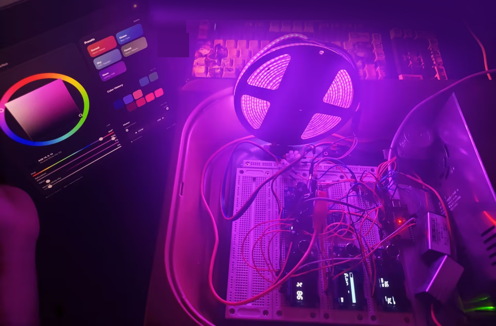
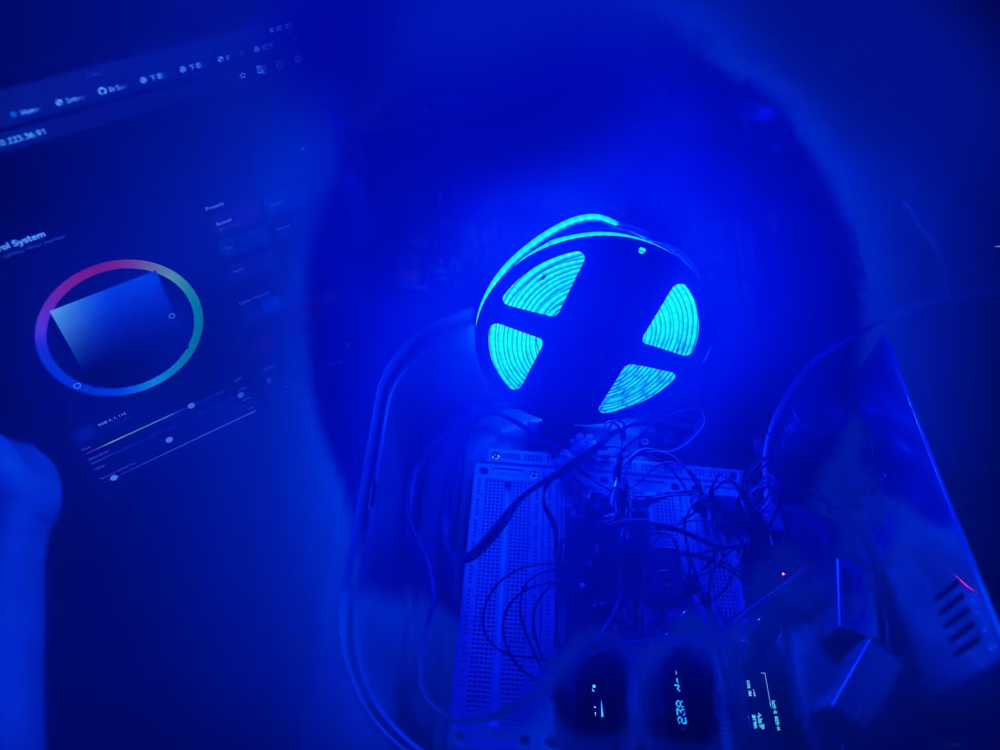

# 做了什么

这个项目把之前那套「多个 OLED + 旋钮」的实验变成了一个真正要控制东西的控制器。那次验证的是一块 ESP32 能同时带好几个旋钮和屏幕；这次两边都加到四个，而且每个旋钮都有明确的一路要管。

一块 ESP32 上跑着四件事：

1. **三个旋钮配三块 OLED，分别管 H、S、V。** 第一块显示色相和颜色条，第二块显示饱和度，第三块显示明度，右上角是小字的中性白混合比例，底部一行是当前的 H 和 S。
2. **第四个旋钮配第四块 OLED，管电机。** 屏幕上是当前位置和目标位置，旋钮通过 A4988 让步进电机走。
3. **一条 24V 的 RGBNW 灯带。** 红、绿、蓝之外还有一个独立的中性白灯珠，走 NeoPixelBus 驱动。
4. **一个网页。** 有色相环、SV 方块、四根滑块、五个动画场景、颜色历史，以及电机位置。网页每 180ms 读一次板子，所以旋钮和网页两边永远是一致的。

下面这张是同一块板子，左边开着网页界面。灯带就是普通 24V 裸灯带，没加扩散板，所以能看清一颗颗灯珠。



# 硬件

| 部件 | 数量 | 备注 |
|---|---|---|
| ESP32 开发板 | 1 | ESP32-D0WD-V3 |
| TCA9548A I2C 多路复用器 | 1 | 地址 0x70 |
| 1.3" OLED + EC11 模块 | 4 | 是 SH1106，不是 SSD1306 |
| A4988 步进驱动 | 1 | 只用到 DIR 和 STEP |
| 步进电机 | 1 | 小型两相，电源走 24V |
| RGBNW 灯带 | 150 颗 | 24V，R/G/B + 中性白 |
| 24V 电源 | 1 | 和灯带共用 |
| 杜邦线 | 一把 | 短而粗比长而细靠谱 |

# 引脚分配

| 功能 | GPIO | 接到 |
|---|---|---|
| I2C SDA | 21 | TCA9548A SDA |
| I2C SCL | 22 | TCA9548A SCL |
| 灯带数据 | 5 | 330R 电阻进 DIN |
| A4988 DIR | 12 | DIR |
| A4988 STEP | 13 | STEP |
| 色相 A / B | 25 / 18 | EC11 #1 |
| 饱和 A / B | 26 / 27 | EC11 #2 |
| 明度 A / B | 4 / 16 | EC11 #3 |
| 电机 A / B | 32 / 33 | EC11 #4 |

TCA9548A 的 CH0 到 CH3 分别带四块 OLED。四块屏的地址都是 0x3C，没有多路复用器的话它们会同时显示同一帧画面。

EC11 模块的接法和三旋钮那版一样：TRA 和 TRB 接两个 GPIO，CON、PSH、BAK 在自带内部上拉的模块上可以直接悬空。四个旋钮一共 8 个 GPIO，加上 I2C 的 2 个、灯带 1 个、步进 2 个。

# 四个旋钮共用一个中断处理函数

上一版每个编码器写一个 ISR，是复制出来的。四个副本已经开始各自漂移了。`attachInterruptArg` 能把编码器序号传进去，于是只留一个函数体，需要变的只有引脚表：

```cpp
void IRAM_ATTR isrEncoder(void *arg)
{
  uint8_t idx = (uint8_t)(uintptr_t)arg;

  uint8_t s = (digitalRead(ENC_A_PIN[idx]) << 1) | digitalRead(ENC_B_PIN[idx]);

  encState[idx] = ((encState[idx] << 2) | s) & 0x0F;

  int8_t d = KNOB_DIR[encState[idx]];
  if (d) encDelta[idx] += d;
}

attachInterruptArg(digitalPinToInterrupt(ENC_A_PIN[i]), isrEncoder,
                   (void *)(uintptr_t)i, CHANGE);
```

`KNOB_DIR` 还是那张 16 项的 Ben Buxton 表。四次正交跳变算一个物理格，所以累加值要先除以 `ENC_COUNTS_PER_DETENT` 才会真正改变数值。

# RGBNW：两个白，不是一个

灯带有四个通道，有意思的是第四个。中性白是独立于明度混合的，两者加起来才是总亮度：

```cpp
const float nwMix = constrain(outputWhite, 0.0f, 1.0f);
const float rgbValue = constrain(outputVal, 0.0f, 1.0f) * (1.0f - nwMix);

hsvToRgb(outputHue, outputSat, rgbValue, R, G, B);

const uint8_t W = (uint8_t)lroundf(constrain(outputVal, 0.0f, 1.0f) * nwMix * 255.0f);
```

中性白为 0 的时候，灯带就是普通 RGB 灯带的行为。往上加，RGB 那一路同步变暗，剩下的亮度交给白灯珠，所以可以在明度拉满的情况下从饱和色一路走到干净的白，色相不会跑偏。

## 通道顺序和名字对不上

这条灯带物理上是 WRGB 的顺序。NeoPixelBus 会把逻辑上的 `RgbwColor` 序列化成 GRBW，所以最顺手的写法恰好是错的：

```cpp
/*
 * IMPORTANT: the physical WS2814 strip used here behaves as WRGB.
 * NeoGrbwFeature serializes the logical RgbwColor as GRBW, so feeding
 * (R, W, G, B) makes the transmitted bytes become W,R,G,B.
 *
 * With the old (R,G,B,W) call the observed mapping was:
 *   R -> R
 *   G -> W
 *   B -> G
 *   W -> B
 * which exactly explains blue-looking-green and NW-looking-blue.
 */
RgbwColor color(R, W, G, B);
```

按 `(R, G, B, W)` 传进去的时候，绿色看着发蓝，白通道也发蓝。注释里把这四个错误映射一条条列了出来，正是靠它能直接对上现象，而不是回去怀疑接线。

# 输出端再做一层平滑

网页下发的命令不会按固定节奏到达。拖动的时候请求发得又快又密，轮询又可能安静一阵，而灯带是固定 16ms 刷一次。把目标值直接写进灯带，这些不均匀就会变成肉眼可见的台阶，所以输出用指数滤波去追目标：

```cpp
const float alpha = 1.0f - expf(-((float)dtMs / LIGHT_SMOOTHING_MS));

float hueDelta = (float)hueValue - outputHue;
while (hueDelta > 180.0f) hueDelta -= 360.0f;   // 走最短弧
while (hueDelta < -180.0f) hueDelta += 360.0f;

outputHue   += hueDelta * alpha;
outputSat   += ((float)satValue   / 100.0f - outputSat)   * alpha;
outputVal   += ((float)valValue   / 100.0f - outputVal)   * alpha;
outputWhite += ((float)whiteValue / 100.0f - outputWhite) * alpha;
```

色相按最短弧插值，所以从 350 拖到 10 是往前过 0，不会倒着扫过整个色环。`LIGHT_SMOOTHING_MS` 是 35ms。残差小于 0.001 就直接吸附到目标值，灯带最终会彻底静止，而不是永远在极小的差值上飘；既没有脏标记也没有残余运动时，`serviceLED` 直接返回，完全不碰灯带。

# 网页与双向同步

网页存在 PROGMEM 里，包含色相环、画在 canvas 上的 SV 方块、四根滑块、五个场景预设、15 格颜色历史，以及电机读数和 CCW / CW 两个按钮。主题和颜色历史都存在 `localStorage`，历史里保存的是 `[h, s, v, w]`，同时对早期版本的 `[r, g, b]` 记录留了迁移路径。

让旋钮和网页保持一致，花的功夫比界面本身多：

- **网页到板子**：命令走一个小队列，最小间隔 20ms，同一时刻只允许一个请求在飞。拖动会连续产生很多次更新，不排队的话它们会堆积并乱序到达。
- **板子到网页**：`/get` 返回色相、饱和度、明度、中性白，一个 `rev` 修订号，以及电机的当前步和目标步。网页每 180ms 轮询一次。
- **不和用户抢**：指针按下期间、场景动画运行期间、以及本地操作后 220ms 内都跳过同步，所以落在拖动中途的那次轮询不会把数值拽回去。
- **只在变化时重绘**：返回值和页面当前显示的值先比较，真正画东西的只有 `updateUI` 一个地方。

板子不假设网页是它唯一的对话方，网页也不假设自己是唯一在控制板子的人。整套同步靠的就是这一点。

# 五个场景

日落、海洋、天空、森林、霓虹。每个场景就是一组正弦项，逐帧算出 H、S、V 和中性白混合：

```js
case "sunset":
  h = 25 + 18 * Math.sin(t * .42);
  s = .88 + .12 * Math.sin(t * .60);
  v = .68 + .22 * Math.cos(t * .33);
  w = .06 + .04 * (.5 + .5 * Math.sin(t * .24));
  break;
```

再点一次同一个场景就停下来。去动取色器、滑块或者旋钮也会停，动画不会和手动调节打架。

# 电机

第四个旋钮和 CCW / CW 两个按钮都只写 `targetStep`，`updateMotor()` 每 `STEP_INTERVAL_US`（1000us）让 `currentStep` 往目标走一步。行程在软件里限制在正负 100000 步，一个格是 20 步。A4988 这边只用到 DIR 和 STEP，细分由模块上的跳线决定。

草图开头那条安全提醒值得再说一次：**GPIO12 是 strapping 引脚。** 它在启动时决定 flash 电压，在这里能当 DIR 用，只是因为 A4988 的 DIR 输入是高阻。这条线上永远不要加上拉电阻；万一哪天板子起不来了，优先考虑把 DIR 挪到别的脚。

# 踩过的坑

## 坑 1：有一块 OLED 什么都不显示

**现象**：三块屏正常点起来，第四块一直黑着，而且没有报错，因为 `tcaSelect` 是成功的。

**原因**：OLED 初始化循环里先切通道，紧接着就 `begin(0x3C, true)`。TCA9548A 切完通道需要一点时间，切换后的第一次传输会被吃掉。四块里坏哪一块取决于时序。

**解决**：在切通道和 `begin` 之间加 `delay(20)`，和三旋钮那版在自检数字前留的停顿一样。

## 坑 2：绿色看起来是蓝的

**现象**：红是对的，其余全错位。绿色偏蓝，中性白一调高更明显。

**原因**：对着物理顺序为 WRGB 的灯带调用了 `RgbwColor(R, G, B, W)`。

**解决**：改成传 `(R, W, G, B)`。细节见上面。

## 坑 3：拧旋钮的时候网页卡住了

**现象**：一拧旋钮，网页就不再更新，得去点一下取色器才恢复。板子本身没问题，串口一直在打印。

**原因**：网页只在 `lightInFlight` 和 `lightPending` 都为空时才轮询，而拧旋钮前不久刚发出去的那条命令让队列一直认为是忙的。

**解决**：现在只有真实的本地操作才跳过轮询，同时靠修订号告诉网页板子上的状态已经翻篇了。

## 坑 4：编码器触点磨损

**现象**：明度旋钮数值乱跳，最后又回到原处，净变化是零。

**原因**：EC11 有一相位不再翻转了。状态机先看到 +1 再看到 -1，两个互相抵消。

**排查**：写个小程序在拧的时候打印 A、B 两相的原始电平。只有一相在翻转，就是触点磨损。

**解决**：换一个备用模块。GPIO 本身是好的。

# 注意事项

下面几条是从草图开头搬过来的，因为它们都是以后会咬人的地方：

1. **网页没有密码。** 同一个网络里任何人都能改颜色、推动电机。要么把板子放在独立网络里，要么给每个处理函数加上 `server.authenticate()`。
2. **150 颗 RGBW 全白大约 6 到 9A。** 小电源上不要把明度开到 100%，或者在 `updateLEDStrip()` 里加一个亮度上限。
3. **I2C 跑在 400kHz**，总线上还挂着四块屏。线长或者线细会让屏幕出花屏，这时把 `I2C_CLOCK` 降到 100000。
4. **Arduino 会编译 sketch 目录下所有 .ino 文件。** 备份要放进子文件夹，不要和主草图并排。根目录里多出一份副本会让编译报 "redefinition of setup"，这次就是这么撞上的。

# 结果

开机时板子会依次走过 A4988、灯带、多路复用器的四个通道和四块屏，然后联网并开始提供网页：

```
================================
 R2S HSV + MOTOR CONTROLLER
================================
A4988 initialized.
RGBNW strip initialized.
OLED 1 OK
OLED 2 OK
OLED 3 OK
OLED 4 OK
Connecting to YOUR_WIFI_SSID ...
WiFi OK. IP: 192.168.1.xxx
mDNS: http://r2s.local
HTTP server ready.

EC11 #1 -> HUE
EC11 #2 -> SATURATION
EC11 #3 -> VALUE / NW is web-controlled
EC11 #4 -> MOTOR
```

mDNS 默认是开着的，直接用 `http://r2s.local` 就行，不用每次去查 DHCP 分配到的地址。

后面想做的：白通道现在仍然假设白灯珠的 255 和红灯珠的 255 是同样的光量，实际并不是。真正的标定要逐个通道测亮度再做缩放，那才是一个灯光控制器和一块调光板的区别。

# 完整代码

依赖库：NeoPixelBus、Adafruit SH110X、Adafruit GFX Library、Adafruit BusIO。开发板：ESP32 Dev Module。

> 这里的 WiFi 名称和密码已经换成占位符，和板子上跑的草图一致。

```cpp
/*
 * ============================================================
 * R2S ESP32 HSV + MOTOR CONTROLLER
 * ============================================================
 *
 * Hardware:
 *
 * 4x EC11 + 4x SH1106 OLED
 * 1x TCA9548A
 * 1x 24V RGBNW LED Strip (R/G/B + Neutral White)
 * 1x A4988
 * 1x Stepper Motor
 * WiFi Web Control
 *
 * ============================================================
 * MODULE ASSIGNMENT
 * ============================================================
 *
 * EC11 + OLED #1 -> HUE
 * EC11 + OLED #2 -> SATURATION
 * EC11 + OLED #3 -> VALUE + NEUTRAL WHITE MIX status
 * EC11 + OLED #4 -> MOTOR
 *
 * ============================================================
 * I2C
 * ============================================================
 *
 * ESP32:
 * SDA = GPIO21
 * SCL = GPIO22
 *
 * TCA9548A:
 * CH0 -> OLED #1
 * CH1 -> OLED #2
 * CH2 -> OLED #3
 * CH3 -> OLED #4
 *
 * OLED Address = 0x3C
 *
 * ============================================================
 * EC11
 * ============================================================
 *
 * EC11 #1 HUE
 * A = GPIO25
 * B = GPIO18
 *
 * EC11 #2 SATURATION
 * A = GPIO26
 * B = GPIO27
 *
 * EC11 #3 VALUE
 * A = GPIO4
 * B = GPIO16
 *
 * EC11 #4 MOTOR
 * A = GPIO32
 * B = GPIO33
 *
 * ============================================================
 * RGBW LED STRIP
 * ============================================================
 *
 * DATA = GPIO5
 * LED_COUNT = 150
 *
 * GPIO5 -> 330R -> DIN
 * LED +24V -> External 24V PSU
 * LED GND  -> PSU GND
 * ESP32 GND -> PSU GND
 *
 * ============================================================
 * A4988
 * ============================================================
 *
 * DIR  = GPIO12
 * STEP = GPIO13
 *
 * ============================================================
 * ============================================================
 * NOTES / CAUTIONS  (added by the 2026-09 code review)
 * ============================================================
 *
 * 1) GPIO12 (A4988 DIR) is an ESP32 strapping pin (MTDI): it selects the
 *    flash voltage at boot. It works here only because the A4988 DIR input
 *    is high-impedance - never add a pull-up on this line. If the board ever
 *    stops booting, move DIR to a free pin.
 *
 * 2) The web UI has NO password and /motor moves the carriage: anyone on the
 *    same WLAN can drive it. Put the board on its own AP/VLAN, or add
 *    server.authenticate() to every handler, if that matters.
 *
 * 3) 150 RGBW LEDs at full white can pull ~6-9 A (150 x 40..60 mA). Keep
 *    VALUE away from 100% on a small PSU, or add a brightness limit in
 *    updateLEDStrip().
 *
 * 4) I2C runs at 400 kHz with four OLEDs behind the TCA9548A. Long or thin
 *    wires give garbage on screen - then drop I2C_CLOCK to 100000.
 *
 * 5) Arduino compiles EVERY .ino file in the sketch folder: keep backups in
 *    a subfolder (backup\), never next to the main .ino. A stray copy in the
 *    root was breaking the build with "redefinition of setup".
 */

#include <WiFi.h>
#include <WebServer.h>
#include <ESPmDNS.h>   // http://r2s.local instead of a DHCP-dependent IP
#include <Wire.h>
#include <math.h>

#include <Adafruit_GFX.h>
#include <Adafruit_SH110X.h>

#include <NeoPixelBus.h>


// ============================================================
// WiFi
// ============================================================

// The UI is reachable at http://r2s.local (or at the IP printed on serial).
// Set ENABLE_MDNS to 0 if your network blocks multicast DNS.
#define ENABLE_MDNS 1

const char* ssid     = "YOUR_WIFI_SSID";
const char* password = "YOUR_WIFI_PASSWORD";


// ============================================================
// I2C
// ============================================================

#define SDA_PIN    21
#define SCL_PIN    22
#define TCA_ADDR   0x70
#define OLED_ADDR  0x3C

// 400 kHz is faster for four OLEDs.
// If long wires cause instability, change to 100000.
#define I2C_CLOCK 400000


// ============================================================
// EC11
// ============================================================

// HUE
#define ENC_H_A 25
#define ENC_H_B 18

// SATURATION
#define ENC_S_A 26
#define ENC_S_B 27

// VALUE
#define ENC_V_A 4
#define ENC_V_B 16

// MOTOR
#define ENC_M_A 32
#define ENC_M_B 33


// ============================================================
// RGBNW LED STRIP
// ============================================================

#define LED_PIN   5
#define LED_COUNT 150

NeoPixelBus<
  NeoGrbwFeature,
  NeoEsp32Rmt0800KbpsMethod
> strip(
  LED_COUNT,
  LED_PIN
);


// ============================================================
// A4988
// ============================================================

#define A4988_DIR  12
#define A4988_STEP 13

#define STEP_INTERVAL_US 1000

// One encoder click -> this many motor steps
#define MOTOR_STEPS_PER_DETENT 20

// Software travel limits
#define MOTOR_MIN_STEP -100000L
#define MOTOR_MAX_STEP  100000L

// Set true if physical direction is reversed
#define MOTOR_REVERSE false

long currentStep = 0;
long targetStep  = 0;

unsigned long lastStepMicros = 0;


// ============================================================
// OLED
// ============================================================

Adafruit_SH1106G oled1(128, 64, &Wire, -1);
Adafruit_SH1106G oled2(128, 64, &Wire, -1);
Adafruit_SH1106G oled3(128, 64, &Wire, -1);
Adafruit_SH1106G oled4(128, 64, &Wire, -1);


// ============================================================
// Web Server
// ============================================================

WebServer server(80);


// ============================================================
// RGBNW light state (H / S / V + Neutral White Mix)
// ============================================================
//
// H / S / V describe the RGB colour component.
// W is an independent neutral-white mix level.
// The web UI and the physical H/S/V encoders both update this same state.
//

int hueValue = 0;
int satValue = 100;
int valValue = 100;
int whiteValue = 0;   // Neutral White mix, 0..100


// ============================================================
// Encoder state machine
// ============================================================

// DRAM_ATTR: read from the ISR, so keep it in DRAM (a flash access inside an
// interrupt can stall while the other core is writing flash).
static const int8_t DRAM_ATTR KNOB_DIR[16] = {
   0, -1,  1,  0,
   1,  0,  0, -1,
  -1,  0,  0,  1,
   0,  1, -1,  0
};

// Single source of truth for the encoder pins: setup() and the ISR both use it.
static const uint8_t DRAM_ATTR ENC_A_PIN[4] = {
  ENC_H_A, ENC_S_A, ENC_V_A, ENC_M_A
};

static const uint8_t DRAM_ATTR ENC_B_PIN[4] = {
  ENC_H_B, ENC_S_B, ENC_V_B, ENC_M_B
};

volatile uint8_t encState[4] = {
  0, 0, 0, 0
};

volatile int16_t encDelta[4] = {
  0, 0, 0, 0
};

// Four quadrature transitions = one physical click
#define ENC_COUNTS_PER_DETENT 4

int encAccum[4] = {
  0, 0, 0, 0
};


// ============================================================
// Dirty states
// ============================================================

bool ledDirty = true;

bool oledDirty[4] = {
  true,
  true,
  true,
  true
};


// ============================================================
// Output timing
// ============================================================

// LED output refresh. The strip itself takes roughly 6 ms to transmit
// 150 RGBW pixels at 800 kHz, so ~60 FPS is practical here.
#define LED_UPDATE_INTERVAL_MS 16

// Short exponential smoothing keeps the LED output continuous even when
// web commands arrive less frequently than the physical LED refresh.
#define LIGHT_SMOOTHING_MS 35.0f

unsigned long lastLEDUpdate = 0;

// Rendered/output state. hueValue/satValue/valValue/whiteValue remain the
// authoritative target values shown on the OLED and returned by /get.
float outputHue = 0.0f;
float outputSat = 1.0f;
float outputVal = 1.0f;
float outputWhite = 0.0f;


// OLED service
// Only one dirty OLED is updated at a time.
#define OLED_SERVICE_INTERVAL_MS 20

unsigned long lastOLEDService = 0;

uint8_t oledServiceIndex = 0;


// Motor OLED refresh
// Do not redraw OLED #4 every single motor step.
#define MOTOR_OLED_REFRESH_MS 100

unsigned long lastMotorOLEDRefresh = 0;


// ============================================================
// Function declarations
// ============================================================

void handleRoot();
void handleHSV();
void handleMotor();
void handleGet();


// ============================================================
// TCA9548A
// ============================================================

bool tcaSelect(uint8_t channel)
{
  if (channel > 7)
    return false;

  Wire.beginTransmission(TCA_ADDR);
  Wire.write(1 << channel);

  return Wire.endTransmission() == 0;
}


// ============================================================
// OLED dirty
// ============================================================

void markOLED(uint8_t index)
{
  if (index < 4)
    oledDirty[index] = true;
}


// ============================================================
// HSV -> RGB
// ============================================================

void hsvToRgb(
  float h,
  float s,
  float v,
  uint8_t &r,
  uint8_t &g,
  uint8_t &b
)
{
  float H = fmodf(h, 360.0f);
  if (H < 0.0f) H += 360.0f;

  float S = constrain(s, 0.0f, 1.0f);
  float V = constrain(v, 0.0f, 1.0f);

  float C = V * S;

  float X =
    C * (
      1.0f -
      fabsf(
        fmodf(H / 60.0f, 2.0f) - 1.0f
      )
    );

  float M = V - C;

  float rf = 0;
  float gf = 0;
  float bf = 0;

  if (H < 60)
  {
    rf = C;
    gf = X;
  }
  else if (H < 120)
  {
    rf = X;
    gf = C;
  }
  else if (H < 180)
  {
    gf = C;
    bf = X;
  }
  else if (H < 240)
  {
    gf = X;
    bf = C;
  }
  else if (H < 300)
  {
    rf = X;
    bf = C;
  }
  else
  {
    rf = C;
    bf = X;
  }

  r = constrain((rf + M) * 255.0f, 0, 255);
  g = constrain((gf + M) * 255.0f, 0, 255);
  b = constrain((bf + M) * 255.0f, 0, 255);
}


// ============================================================
// RGBNW strip
// ============================================================

void updateLEDStrip()
{
  uint8_t R, G, B;

  const float nwMix =
    constrain(outputWhite, 0.0f, 1.0f);

  const float rgbValue =
    constrain(outputVal, 0.0f, 1.0f) * (1.0f - nwMix);

  hsvToRgb(
    outputHue,
    outputSat,
    rgbValue,
    R, G, B
  );

  const uint8_t W =
    (uint8_t)lroundf(
      constrain(outputVal, 0.0f, 1.0f) *
      nwMix *
      255.0f
    );

  /*
   * IMPORTANT: the physical WS2814 strip used here behaves as WRGB.
   * NeoGrbwFeature serializes the logical RgbwColor as GRBW, so feeding
   * (R, W, G, B) makes the transmitted bytes become W,R,G,B.
   *
   * With the old (R,G,B,W) call the observed mapping was:
   *   R -> R
   *   G -> W
   *   B -> G
   *   W -> B
   * which exactly explains blue-looking-green and NW-looking-blue.
   */
  RgbwColor color(
    R,
    W,
    G,
    B
  );

  strip.ClearTo(color);
  strip.Show();
}


// ============================================================
// LED service + smooth interpolation
// ============================================================

void serviceLED()
{
  const unsigned long now = millis();

  if (
    now - lastLEDUpdate <
    LED_UPDATE_INTERVAL_MS
  )
  {
    return;
  }

  const unsigned long dtMs =
    (lastLEDUpdate == 0)
      ? LED_UPDATE_INTERVAL_MS
      : (now - lastLEDUpdate);

  lastLEDUpdate = now;

  // Critically damped-ish exponential response. This behaves smoothly for
  // scene animation but settles quickly after manual knob changes.
  const float alpha =
    1.0f - expf(
      -((float)dtMs / LIGHT_SMOOTHING_MS)
    );

  // Hue wraps around 0/360, so interpolate through the shortest arc.
  float hueDelta =
    (float)hueValue - outputHue;

  while (hueDelta > 180.0f) hueDelta -= 360.0f;
  while (hueDelta < -180.0f) hueDelta += 360.0f;

  outputHue += hueDelta * alpha;
  outputSat += ((float)satValue / 100.0f - outputSat) * alpha;
  outputVal += ((float)valValue / 100.0f - outputVal) * alpha;
  outputWhite += ((float)whiteValue / 100.0f - outputWhite) * alpha;

  // Snap tiny residuals so the output eventually becomes exactly stable.
  const float targetHue = (float)hueValue;
  const float targetSat = (float)satValue / 100.0f;
  const float targetVal = (float)valValue / 100.0f;
  const float targetWhite = (float)whiteValue / 100.0f;

  if (fabsf(hueDelta) < 0.03f) outputHue = targetHue;
  if (fabsf(targetSat - outputSat) < 0.001f) outputSat = targetSat;
  if (fabsf(targetVal - outputVal) < 0.001f) outputVal = targetVal;
  if (fabsf(targetWhite - outputWhite) < 0.001f) outputWhite = targetWhite;

  // Normalize hue after interpolation.
  if (outputHue >= 360.0f) outputHue -= 360.0f;
  if (outputHue < 0.0f) outputHue += 360.0f;

  const bool stillMoving =
    fabsf(hueDelta) >= 0.03f ||
    fabsf(targetSat - outputSat) >= 0.001f ||
    fabsf(targetVal - outputVal) >= 0.001f ||
    fabsf(targetWhite - outputWhite) >= 0.001f;

  if (!ledDirty && !stillMoving)
    return;

  updateLEDStrip();
  ledDirty = false;
}


// ============================================================
// OLED standard draw
// ============================================================

void drawValueOLED(
  Adafruit_SH1106G &display,
  const char* title,
  int value,
  int maxValue,
  const char* suffix
)
{
  display.clearDisplay();

  display.setTextColor(
    SH110X_WHITE
  );

  display.setTextSize(1);

  display.setCursor(0, 0);
  display.print(title);

  display.setTextSize(3);

  display.setCursor(0, 16);
  display.print(value);
  display.print(suffix);

  display.drawRect(
    0, 50,
    128, 12,
    SH110X_WHITE
  );

  // constrain(): a value above maxValue (or a maxValue of 0) used to draw the
  // bar outside the frame.
  int fillW = constrain(
    map(
      value,
      0,
      maxValue,
      0,
      126
    ),
    0,
    126
  );

  if (fillW > 0)
  {
    display.fillRect(
      1, 51,
      fillW, 10,
      SH110X_WHITE
    );
  }

  display.display();
}


// ============================================================
// OLED #3 value + neutral white
// ============================================================

void drawValueWhiteOLED()
{
  if (!tcaSelect(2))
    return;

  oled3.clearDisplay();

  oled3.setTextColor(SH110X_WHITE);

  oled3.setTextSize(1);
  oled3.setCursor(0, 0);
  oled3.print("VALUE");

  oled3.setTextSize(2);
  oled3.setCursor(0, 13);
  oled3.print(valValue);
  oled3.print("%");

  oled3.setTextSize(1);
  oled3.setCursor(72, 0);
  oled3.print("NW MIX");

  oled3.setTextSize(2);
  oled3.setCursor(72, 13);
  oled3.print(whiteValue);
  oled3.print("%");

  oled3.drawRect(
    0, 38,
    128, 11,
    SH110X_WHITE
  );

  int fillW =
    constrain(
      map(valValue, 0, 100, 0, 126),
      0,
      126
    );

  if (fillW > 0)
  {
    oled3.fillRect(
      1, 39,
      fillW, 9,
      SH110X_WHITE
    );
  }

  oled3.setTextSize(1);
  oled3.setCursor(0, 53);
  oled3.print("H:");
  oled3.print(hueValue);
  oled3.print(" S:");
  oled3.print(satValue);
  oled3.print("%");

  oled3.display();
}


// ============================================================
// OLED #4 motor
// ============================================================

void drawMotorOLED()
{
  if (!tcaSelect(3))
    return;

  oled4.clearDisplay();

  oled4.setTextColor(
    SH110X_WHITE
  );

  oled4.setTextSize(1);

  oled4.setCursor(0, 0);
  oled4.print("MOTOR");

  oled4.setTextSize(2);

  oled4.setCursor(0, 16);
  oled4.print(currentStep);
  oled4.print(" st");

  oled4.setCursor(0, 40);
  oled4.print("T:");
  oled4.print(targetStep);

  oled4.display();
}


// ============================================================
// OLED service
// ============================================================

void serviceOLED()
{
  unsigned long now = millis();

  if (
    now - lastOLEDService <
    OLED_SERVICE_INTERVAL_MS
  )
  {
    return;
  }

  lastOLEDService = now;

  for (int i = 0; i < 4; i++)
  {
    uint8_t index =
      (oledServiceIndex + i) % 4;

    if (!oledDirty[index])
      continue;

    oledServiceIndex =
      (index + 1) % 4;

    switch (index)
    {
      case 0:
        if (tcaSelect(0))
        {
          drawValueOLED(
            oled1,
            "HUE",
            hueValue,
            360,
            " deg"
          );
        }
        break;

      case 1:
        if (tcaSelect(1))
        {
          drawValueOLED(
            oled2,
            "SATURATION",
            satValue,
            100,
            " %"
          );
        }
        break;

      case 2:
        drawValueWhiteOLED();
        break;

      case 3:
        drawMotorOLED();
        break;
    }

    oledDirty[index] = false;

    break;
  }
}


// ============================================================
// Encoder ISR - one handler for all four encoders
// ============================================================
//
// attachInterruptArg() passes the encoder index, so the body no longer has to
// be copy-pasted four times (the copies had already started to drift).

void IRAM_ATTR isrEncoder(void *arg)
{
  uint8_t idx =
    (uint8_t)(uintptr_t)arg;

  uint8_t s =
    (
      digitalRead(ENC_A_PIN[idx]) << 1
    ) |
    digitalRead(ENC_B_PIN[idx]);

  encState[idx] =
    (
      (encState[idx] << 2) | s
    ) & 0x0F;

  int8_t d =
    KNOB_DIR[encState[idx]];

  if (d)
    encDelta[idx] += d;
}


// ============================================================
// Handle encoders
// ============================================================

void handleEncoders()
{
  int16_t d[4];

  noInterrupts();

  d[0] = encDelta[0];
  d[1] = encDelta[1];
  d[2] = encDelta[2];
  d[3] = encDelta[3];

  encDelta[0] = 0;
  encDelta[1] = 0;
  encDelta[2] = 0;
  encDelta[3] = 0;

  interrupts();


  // ==========================================================
  // HUE
  // ==========================================================

  encAccum[0] += d[0];

  int hueSteps =
    encAccum[0] /
    ENC_COUNTS_PER_DETENT;

  if (hueSteps != 0)
  {
    encAccum[0] -=
      hueSteps *
      ENC_COUNTS_PER_DETENT;

    hueValue =
      constrain(
        hueValue + hueSteps,
        0,
        360
      );

    ledDirty = true;

    markOLED(0);
  }


  // ==========================================================
  // SATURATION
  // ==========================================================

  encAccum[1] += d[1];

  int satSteps =
    encAccum[1] /
    ENC_COUNTS_PER_DETENT;

  if (satSteps != 0)
  {
    encAccum[1] -=
      satSteps *
      ENC_COUNTS_PER_DETENT;

    satValue =
      constrain(
        satValue + satSteps,
        0,
        100
      );

    ledDirty = true;

    markOLED(1);
  }


  // ==========================================================
  // VALUE
  // ==========================================================

  encAccum[2] += d[2];

  int valSteps =
    encAccum[2] /
    ENC_COUNTS_PER_DETENT;

  if (valSteps != 0)
  {
    encAccum[2] -=
      valSteps *
      ENC_COUNTS_PER_DETENT;

    valValue =
      constrain(
        valValue + valSteps,
        0,
        100
      );

    ledDirty = true;

    markOLED(2);
  }


  // ==========================================================
  // MOTOR
  // ==========================================================

  encAccum[3] += d[3];

  int motorDetents =
    encAccum[3] /
    ENC_COUNTS_PER_DETENT;

  if (motorDetents != 0)
  {
    encAccum[3] -=
      motorDetents *
      ENC_COUNTS_PER_DETENT;

    targetStep +=
      (long)motorDetents *
      MOTOR_STEPS_PER_DETENT;

    targetStep =
      constrain(
        targetStep,
        MOTOR_MIN_STEP,
        MOTOR_MAX_STEP
      );

    markOLED(3);
  }
}


// ============================================================
// Motor update
// ============================================================

void updateMotor()
{
  if (
    currentStep ==
    targetStep
  )
  {
    return;
  }

  unsigned long now =
    micros();

  if (
    now - lastStepMicros <
    STEP_INTERVAL_US
  )
  {
    return;
  }

  lastStepMicros = now;

  bool clockwise =
    targetStep > currentStep;

  if (MOTOR_REVERSE)
  {
    clockwise = !clockwise;
  }

  digitalWrite(
    A4988_DIR,
    clockwise ? HIGH : LOW
  );

  digitalWrite(
    A4988_STEP,
    HIGH
  );

  delayMicroseconds(3);

  digitalWrite(
    A4988_STEP,
    LOW
  );

  if (clockwise)
    currentStep++;
  else
    currentStep--;

  /*
   * Do NOT refresh OLED every step.
   * The main loop handles a 100ms motor refresh.
   */

  if (
    currentStep ==
    targetStep
  )
  {
    markOLED(3);
  }
}


// ============================================================
// Set RGBNW state
// ============================================================

void setLightState(
  int h,
  int s,
  int v,
  int w
)
{
  const int oldH = hueValue;
  const int oldS = satValue;
  const int oldV = valValue;
  const int oldW = whiteValue;

  hueValue =
    constrain(
      h,
      0,
      360
    );

  satValue =
    constrain(
      s,
      0,
      100
    );

  valValue =
    constrain(
      v,
      0,
      100
    );

  whiteValue =
    constrain(
      w,
      0,
      100
    );

  if (
    oldH != hueValue ||
    oldS != satValue ||
    oldV != valValue ||
    oldW != whiteValue
  )
  {
    ledDirty = true;
  }

  // Only refresh OLEDs whose displayed data actually changed.
  if (oldH != hueValue)
  {
    markOLED(0);
    markOLED(2); // OLED #3 also shows H in its footer.
  }

  if (oldS != satValue)
  {
    markOLED(1);
    markOLED(2);
  }

  if (oldV != valValue)
    markOLED(2);

  if (oldW != whiteValue)
    markOLED(2);
}


// ============================================================
// Web page
// ============================================================

const char htmlPage[] PROGMEM = R"rawliteral(
<!DOCTYPE html>
<html lang="en">
<head>
<meta charset="utf-8">
<meta name="viewport" content="width=device-width,initial-scale=1,user-scalable=no">
<title>R²S Control System</title>

<style>
:root{
  --bg:#070707;
  --panel:rgba(25,25,28,.74);
  --panel-soft:rgba(255,255,255,.045);
  --panel-strong:rgba(255,255,255,.075);
  --text:#f5f5f7;
  --muted:rgba(245,245,247,.56);
  --border:rgba(255,255,255,.12);
  --accent:#ff8a2b;
  --good:#30d158;
  --shadow:rgba(0,0,0,.46);
  --hue:0;
}

body.light{
  --bg:#f2f2f7;
  --panel:rgba(255,255,255,.78);
  --panel-soft:rgba(0,0,0,.028);
  --panel-strong:rgba(0,0,0,.045);
  --text:#1c1c1e;
  --muted:rgba(28,28,30,.56);
  --border:rgba(0,0,0,.10);
  --shadow:rgba(0,0,0,.11);
}

*{box-sizing:border-box}
html,body{margin:0;padding:0;min-height:100%}

body{
  min-height:100vh;
  padding:20px;
  display:flex;
  align-items:center;
  justify-content:center;
  overflow-x:hidden;
  font-family:-apple-system,BlinkMacSystemFont,"Segoe UI",Roboto,Arial,sans-serif;
  background:
    radial-gradient(circle at 50% 10%,rgba(255,255,255,.04),transparent 44%),
    var(--bg);
  color:var(--text);
  transition:background .35s ease,color .25s ease;
}

#bg-glow{
  position:fixed;
  inset:-15%;
  z-index:0;
  pointer-events:none;
  opacity:.72;
  filter:blur(100px);
  background:radial-gradient(circle at 50% 45%,rgba(255,110,40,.28),transparent 58%);
  transition:background .45s ease;
}

.app{
  position:relative;
  z-index:2;
  width:min(1160px,100%);
  padding:26px;
  background:var(--panel);
  border:1px solid var(--border);
  border-radius:32px;
  backdrop-filter:blur(30px);
  -webkit-backdrop-filter:blur(30px);
  box-shadow:0 30px 80px var(--shadow);
}

.header{
  display:flex;
  align-items:center;
  justify-content:space-between;
  gap:16px;
  margin-bottom:20px;
}

.brand{display:flex;align-items:center;gap:12px}

.brand-mark{
  width:40px;height:40px;border-radius:13px;
  border:1px solid var(--border);
  background:var(--panel-strong);
  display:flex;align-items:center;justify-content:center;
  font-size:13px;font-weight:800;letter-spacing:-.2px;
}

.title{font-size:21px;font-weight:700;letter-spacing:-.45px}
.subtitle{margin-top:3px;font-size:11px;color:var(--muted);letter-spacing:.3px}

.icon-btn{
  width:42px;height:42px;border-radius:50%;
  border:1px solid var(--border);
  background:var(--panel-strong);
  color:var(--text);
  font-size:18px;
  cursor:pointer;
  display:flex;align-items:center;justify-content:center;
  transition:transform .18s ease,background .18s ease;
  touch-action:manipulation;
}
.icon-btn:hover{transform:scale(1.05);background:rgba(255,255,255,.12)}

.main-grid{
  display:grid;
  grid-template-columns:minmax(0,1.26fr) minmax(330px,.74fr);
  gap:20px;
}

.card{
  padding:20px;
  border-radius:24px;
  border:1px solid var(--border);
  background:var(--panel-soft);
}

.color-card{
  display:flex;
  flex-direction:column;
  align-items:center;
}

.picker-wrap{
  width:min(520px,100%);
  margin:auto;
}

#pickerCanvas{
  display:block;
  width:100%;
  aspect-ratio:1;
  touch-action:none;
  user-select:none;
  -webkit-user-select:none;
  cursor:crosshair;
}

.picker-info{
  display:flex;
  align-items:center;
  justify-content:space-between;
  gap:14px;
  width:100%;
  margin-top:2px;
}

.swatch-row{
  display:flex;
  align-items:center;
  gap:11px;
  min-width:0;
}

.current-swatch{
  width:58px;height:42px;border-radius:12px;
  border:1px solid rgba(255,255,255,.25);
  box-shadow:inset 0 0 0 1px rgba(0,0,0,.16),0 7px 20px rgba(0,0,0,.18);
  flex:none;
}

.rgb-readout{font-size:12px;line-height:1.45}
.rgb-readout strong{font-weight:700}
.rgb-readout span{color:var(--muted)}

.controls{
  width:100%;
  margin-top:18px;
  display:grid;
  gap:14px;
}

.control{display:grid;gap:7px}

.control-head{
  display:flex;
  align-items:center;
  justify-content:space-between;
  font-size:13px;
}

.control-name{opacity:.82}
.control-value{
  font-weight:700;
  font-variant-numeric:tabular-nums;
}

input[type=range]{
  width:100%;
  height:6px;
  margin:0;
  appearance:none;
  -webkit-appearance:none;
  outline:none;
  border-radius:5px;
  background:#3a3a3c;
}

input[type=range]::-webkit-slider-thumb{
  appearance:none;-webkit-appearance:none;
  width:22px;height:22px;border-radius:50%;
  background:#f5f5f7;
  border:2px solid rgba(0,0,0,.10);
  box-shadow:0 2px 8px rgba(0,0,0,.28);
}
input[type=range]::-moz-range-thumb{
  width:20px;height:20px;border-radius:50%;
  background:#f5f5f7;border:2px solid rgba(0,0,0,.10);
}

#h{
  background:linear-gradient(90deg,
    #ff0000 0%,
    #ffff00 16.6%,
    #00ff00 33.3%,
    #00ffff 50%,
    #0000ff 66.6%,
    #ff00ff 83.3%,
    #ff0000 100%);
}

#s{
  background:linear-gradient(90deg,#808080,hsl(var(--hue),100%,50%));
}

#v{
  background:linear-gradient(90deg,#050505,hsl(var(--hue),100%,50%));
}

#w{
  background:linear-gradient(90deg,#5b5b5b,#fff);
}

.side{display:flex;flex-direction:column;gap:16px}

.section-title{
  display:flex;
  align-items:center;
  justify-content:space-between;
  gap:12px;
  margin-bottom:11px;
  font-size:14px;
  font-weight:700;
}

.section-subtitle{font-size:10px;color:var(--muted);font-weight:500}

.scenes{
  display:grid;
  grid-template-columns:repeat(2,1fr);
  gap:9px;
}

.scene{
  position:relative;
  min-height:66px;
  overflow:hidden;
  border:1px solid var(--border);
  border-radius:16px;
  background:rgba(255,255,255,.045);
  color:var(--text);
  cursor:pointer;
  padding:0;
  text-align:left;
  transition:transform .16s ease,border-color .16s ease,background .16s ease;
  touch-action:manipulation;
  -webkit-user-select:none;
  user-select:none;
}
.scene:hover{transform:translateY(-2px);background:rgba(255,255,255,.08)}
.scene.active{border-color:rgba(255,255,255,.42);box-shadow:inset 0 0 0 1px rgba(255,255,255,.08)}

.scene-gradient{position:absolute;inset:0;opacity:.45}
.scene-content{
  position:relative;z-index:2;height:100%;padding:12px;
  display:flex;flex-direction:column;justify-content:flex-end;
}
.scene-name{font-size:13px;font-weight:700}
.scene-description{margin-top:3px;font-size:10px;opacity:.66}

.history{
  display:grid;
  grid-template-columns:repeat(5,1fr);
  gap:8px;
}
.swatch{
  width:100%;aspect-ratio:1;border-radius:11px;
  border:1px solid rgba(255,255,255,.22);
  cursor:pointer;
  transition:transform .13s ease,border-color .13s ease;
  touch-action:manipulation;
  -webkit-user-select:none;
  user-select:none;
}
.swatch:hover{transform:scale(1.06);border-color:rgba(255,255,255,.68)}
.empty-history{
  grid-column:1/-1;
  padding:16px;border-radius:13px;text-align:center;
  background:rgba(255,255,255,.04);color:var(--muted);font-size:12px;
}

.motor-status{
  display:flex;justify-content:space-between;align-items:flex-end;
  gap:14px;margin-bottom:12px;
}
.motor-label{font-size:10px;color:var(--muted)}
.motor-step{margin-top:2px;font-size:24px;font-weight:750;font-variant-numeric:tabular-nums}
.motor-buttons{display:grid;grid-template-columns:1fr 1fr;gap:10px}
.motor-btn{
  border:1px solid var(--border);
  border-radius:15px;
  padding:14px 12px;
  background:rgba(255,255,255,.07);
  color:var(--text);
  font-size:14px;
  font-weight:700;
  cursor:pointer;
  transition:background .15s ease,transform .1s ease;
  touch-action:manipulation;
  -webkit-user-select:none;
  user-select:none;
}
.motor-btn:hover{background:rgba(255,255,255,.12)}
.motor-btn:active{transform:scale(.97)}

.status{
  display:flex;align-items:center;gap:8px;
  margin-top:13px;font-size:11px;color:var(--muted);
}
.status-dot{
  width:8px;height:8px;border-radius:50%;
  background:var(--good);box-shadow:0 0 10px rgba(48,209,88,.4);
}

.footer{
  display:flex;justify-content:space-between;align-items:center;
  gap:14px;margin-top:17px;font-size:10px;color:var(--muted);
}

@media(max-width:860px){
  .main-grid{grid-template-columns:1fr}
}
@media(max-width:560px){
  body{padding:9px}
  .app{padding:14px;border-radius:24px}
  .card{padding:16px;border-radius:20px}
  .title{font-size:18px}
  .main-grid{gap:14px}
  .picker-wrap{width:min(440px,100%)}
}
</style>
</head>

<body>
<div id="bg-glow"></div>

<div class="app">
  <div class="header">
    <div class="brand">
      <div class="brand-mark">R²S</div>
      <div>
        <div class="title">Control System</div>
        <div class="subtitle">RGBNW Lighting / Motor Interface</div>
      </div>
    </div>
    <button class="icon-btn" id="theme-toggle" aria-label="Toggle theme">☀️</button>
  </div>

  <div class="main-grid">
    <div class="card color-card">
      <div class="picker-wrap">
        <canvas id="pickerCanvas" aria-label="Hue wheel and saturation/value picker"></canvas>

        <div class="picker-info">
          <div class="swatch-row">
            <div class="current-swatch" id="current-swatch"></div>
            <div class="rgb-readout">
              <strong id="rgb-value">RGB 255, 0, 0</strong><br>
              <span id="nw-readout">Neutral White Mix 0%</span>
            </div>
          </div>
          <div class="section-subtitle" id="sync-readout">LIVE</div>
        </div>

        <div class="controls">
          <div class="control">
            <div class="control-head">
              <span class="control-name">Hue</span>
              <span class="control-value" id="h-value">0°</span>
            </div>
            <input id="h" type="range" min="0" max="360" value="0">
          </div>

          <div class="control">
            <div class="control-head">
              <span class="control-name">Saturation</span>
              <span class="control-value" id="s-value">100%</span>
            </div>
            <input id="s" type="range" min="0" max="100" value="100">
          </div>

          <div class="control">
            <div class="control-head">
              <span class="control-name">Value</span>
              <span class="control-value" id="v-value">100%</span>
            </div>
            <input id="v" type="range" min="0" max="100" value="100">
          </div>

          <div class="control">
            <div class="control-head">
              <span class="control-name">Neutral White Mix</span>
              <span class="control-value" id="w-value">0%</span>
            </div>
            <input id="w" type="range" min="0" max="100" value="0">
          </div>
        </div>
      </div>
    </div>

    <div class="side">
      <div class="card">
        <div class="section-title">
          <span>Presets</span>
          <span class="section-subtitle">Scenes</span>
        </div>

        <div class="scenes">
          <button class="scene" data-scene="sunset">
            <div class="scene-gradient" style="background:linear-gradient(135deg,#ff6a00,#ff2358)"></div>
            <div class="scene-content">
              <div class="scene-name">Sunset</div>
              <div class="scene-description">Warm / Amber</div>
            </div>
          </button>

          <button class="scene" data-scene="ocean">
            <div class="scene-gradient" style="background:linear-gradient(135deg,#00c6ff,#005bea)"></div>
            <div class="scene-content">
              <div class="scene-name">Ocean</div>
              <div class="scene-description">Blue / Cyan</div>
            </div>
          </button>

          <button class="scene" data-scene="sky">
            <div class="scene-gradient" style="background:linear-gradient(135deg,#89f7fe,#66a6ff)"></div>
            <div class="scene-content">
              <div class="scene-name">Sky</div>
              <div class="scene-description">Soft / Daylight</div>
            </div>
          </button>

          <button class="scene" data-scene="forest">
            <div class="scene-gradient" style="background:linear-gradient(135deg,#56ab2f,#a8e063)"></div>
            <div class="scene-content">
              <div class="scene-name">Forest</div>
              <div class="scene-description">Green / Natural</div>
            </div>
          </button>

          <button class="scene" data-scene="neon">
            <div class="scene-gradient" style="background:linear-gradient(135deg,#7f00ff,#e100ff)"></div>
            <div class="scene-content">
              <div class="scene-name">Neon</div>
              <div class="scene-description">Cycling / RGB</div>
            </div>
          </button>
        </div>
      </div>

      <div class="card">
        <div class="section-title">
          <span>Color History</span>
          <span class="section-subtitle" id="history-count">0 / 15</span>
        </div>
        <div class="history" id="history-grid"></div>
      </div>

      <div class="card">
        <div class="section-title">
          <span>Motor</span>
          <span class="section-subtitle">EC11 #4</span>
        </div>

        <div class="motor-status">
          <div>
            <div class="motor-label">Current Position</div>
            <div class="motor-step" id="current-step">0</div>
          </div>
          <div style="text-align:right">
            <div class="motor-label">Target</div>
            <div class="motor-step" id="target-step">0</div>
          </div>
        </div>

        <div class="motor-buttons">
          <button class="motor-btn" onclick="moveMotor(-1)">◀ &nbsp; CCW</button>
          <button class="motor-btn" onclick="moveMotor(1)">CW &nbsp; ▶</button>
        </div>

        <div class="status">
          <span class="status-dot"></span>
          <span id="status-text">Connecting…</span>
        </div>
      </div>
    </div>
  </div>

  <div class="footer">
    <span>EC11 × 3 → H / S / V &nbsp;·&nbsp; Web → Neutral White Mix</span>
    <span>ESP32 · RGBNW</span>
  </div>
</div>

<script>
/* ===========================================================
   State
   =========================================================== */

let H = 0;
let S = 1;
let V = 1;
let W = 0;

let activeScene = null;
let animationId = null;

let dragging = null;
let lastInteraction = 0;

/* ===========================================================
   Network
   =========================================================== */

let lightPending = false;
let sendTimer = null;
let lastSendTime = 0;
let lightInFlight = false;
let pollInFlight = false;

const SEND_INTERVAL = 20;
const POLL_INTERVAL = 180;

let serverRevision = -1;

/* ===========================================================
   History
   =========================================================== */

const MAX_HISTORY = 15;
let colorHistory = [];

try{
  colorHistory = JSON.parse(
    localStorage.getItem("r2s-color-history") || "[]"
  );
}catch(_){
  colorHistory = [];
}

/* History migration:
   old version stored [r,g,b], new version stores [h,s,v,w].
*/
colorHistory = colorHistory
  .filter(c => Array.isArray(c) && (c.length === 3 || c.length === 4))
  .map(c => {
    if(c.length === 4){
      return c.map(Number);
    }
    const hsv = rgbToHsv(
      Number(c[0]),
      Number(c[1]),
      Number(c[2])
    );
    return [hsv.h,hsv.s,hsv.v,0];
  })
  .filter(c => c.every(n => Number.isFinite(n)))
  .slice(0,MAX_HISTORY);

/* ===========================================================
   DOM
   =========================================================== */

const canvas = document.getElementById("pickerCanvas");
const ctx = canvas.getContext("2d");
const bgGlow = document.getElementById("bg-glow");
const currentSwatch = document.getElementById("current-swatch");
const rgbValue = document.getElementById("rgb-value");
const nwReadout = document.getElementById("nw-readout");
const syncReadout = document.getElementById("sync-readout");

/* ===========================================================
   Picker geometry
   =========================================================== */

let pickerSize = 0;
let pickerCenter = 0;
let ringRadius = 0;
let ringThickness = 0;
let svSize = 0;
let svLeft = 0;
let svTop = 0;
let dpr = 1;

function updatePickerGeometry(){
  const rect = canvas.getBoundingClientRect();
  pickerSize = Math.max(1,rect.width);
  pickerCenter = pickerSize / 2;
  ringRadius = pickerSize * 0.405;
  ringThickness = Math.max(16,pickerSize * 0.052);
  svSize = pickerSize * 0.555;
  svLeft = pickerCenter - svSize / 2;
  svTop = pickerCenter - svSize / 2;

  dpr = Math.min(window.devicePixelRatio || 1,2);

  canvas.width = Math.round(pickerSize * dpr);
  canvas.height = Math.round(pickerSize * dpr);

  ctx.setTransform(dpr,0,0,dpr,0,0);
  drawPicker();
}

/* ===========================================================
   Colour conversion
   =========================================================== */

function hsvToRgb(h,s,v){
  const c = v*s;
  const x = c * (1 - Math.abs((h/60)%2 - 1));
  const m = v-c;

  let r=0,g=0,b=0;

  if(h<60){r=c;g=x}
  else if(h<120){r=x;g=c}
  else if(h<180){g=c;b=x}
  else if(h<240){g=x;b=c}
  else if(h<300){r=x;b=c}
  else{r=c;b=x}

  return [
    Math.round((r+m)*255),
    Math.round((g+m)*255),
    Math.round((b+m)*255)
  ];
}

function rgbToHsv(r,g,b){
  r/=255; g/=255; b/=255;

  const max=Math.max(r,g,b);
  const min=Math.min(r,g,b);
  const d=max-min;

  let h=0;

  if(d!==0){
    if(max===r){
      h=60*(((g-b)/d)%6);
    }else if(max===g){
      h=60*((b-r)/d+2);
    }else{
      h=60*((r-g)/d+4);
    }
  }

  if(h<0) h+=360;

  const s=max===0 ? 0 : d/max;
  return {h,s,v:max};
}

/* Monitor-side approximation of the RGB + neutral-white output. */
function previewRgb(){
  const rgb = hsvToRgb(H,S,V*(1-W));
  const whiteLevel = Math.round(V*W*255);

  return rgb.map(c =>
    Math.round(c + whiteLevel)
  );
}

/* ===========================================================
   Picker drawing
   =========================================================== */

function drawHueRing(){
  const cx=pickerCenter;
  const cy=pickerCenter;
  const radius=ringRadius;

  ctx.save();
  ctx.lineWidth=ringThickness;
  ctx.lineCap="butt";

  if(typeof ctx.createConicGradient === "function"){
    const g=ctx.createConicGradient(-Math.PI/2,cx,cy);
    g.addColorStop(0,"#ff0000");
    g.addColorStop(1/6,"#ffff00");
    g.addColorStop(2/6,"#00ff00");
    g.addColorStop(3/6,"#00ffff");
    g.addColorStop(4/6,"#0000ff");
    g.addColorStop(5/6,"#ff00ff");
    g.addColorStop(1,"#ff0000");

    ctx.beginPath();
    ctx.arc(cx,cy,radius,0,Math.PI*2);
    ctx.strokeStyle=g;
    ctx.stroke();
  }else{
    for(let i=0;i<360;i++){
      const a0=(i/360)*Math.PI*2-Math.PI/2;
      const a1=((i+1.4)/360)*Math.PI*2-Math.PI/2;
      ctx.beginPath();
      ctx.arc(cx,cy,radius,a0,a1);
      ctx.strokeStyle=`hsl(${i},100%,50%)`;
      ctx.stroke();
    }
  }

  ctx.restore();

  /* Fine neutral separators make the ring read like a physical control. */
  ctx.save();
  ctx.lineWidth=1;
  ctx.strokeStyle="rgba(255,255,255,.12)";
  ctx.beginPath();
  ctx.arc(cx,cy,radius-ringThickness/2,0,Math.PI*2);
  ctx.arc(cx,cy,radius+ringThickness/2,0,Math.PI*2);
  ctx.stroke();
  ctx.restore();
}

function drawSvSquare(){
  const hueRgb=hsvToRgb(H,1,1);
  const hueCss=`rgb(${hueRgb[0]},${hueRgb[1]},${hueRgb[2]})`;

  ctx.save();

  /* White -> pure hue */
  const gSat=ctx.createLinearGradient(
    svLeft,svTop,
    svLeft+svSize,svTop
  );
  gSat.addColorStop(0,"#ffffff");
  gSat.addColorStop(1,hueCss);

  ctx.fillStyle=gSat;
  ctx.fillRect(svLeft,svTop,svSize,svSize);

  /* Transparent -> black */
  const gVal=ctx.createLinearGradient(
    0,svTop,
    0,svTop+svSize
  );
  gVal.addColorStop(0,"rgba(0,0,0,0)");
  gVal.addColorStop(1,"rgba(0,0,0,1)");

  ctx.fillStyle=gVal;
  ctx.fillRect(svLeft,svTop,svSize,svSize);

  ctx.strokeStyle="rgba(255,255,255,.28)";
  ctx.lineWidth=1;
  ctx.strokeRect(svLeft+.5,svTop+.5,svSize-1,svSize-1);

  ctx.restore();
}

function drawPicker(){
  if(!pickerSize) return;

  ctx.clearRect(0,0,pickerSize,pickerSize);

  drawHueRing();
  drawSvSquare();

  /* Hue handle */
  const rad=H*Math.PI/180;
  const hx=pickerCenter + ringRadius*Math.sin(rad);
  const hy=pickerCenter - ringRadius*Math.cos(rad);

  ctx.save();
  ctx.beginPath();
  ctx.arc(hx,hy,9,0,Math.PI*2);
  ctx.fillStyle="rgba(0,0,0,.34)";
  ctx.fill();

  ctx.beginPath();
  ctx.arc(hx,hy,8,0,Math.PI*2);
  ctx.fillStyle="hsl(" + H + ",100%,50%)";
  ctx.fill();
  ctx.lineWidth=3;
  ctx.strokeStyle="#fff";
  ctx.stroke();
  ctx.restore();

  /* S/V handle */
  const sx=svLeft + S*svSize;
  const sy=svTop + (1-V)*svSize;

  ctx.save();
  ctx.beginPath();
  ctx.arc(sx,sy,9,0,Math.PI*2);
  ctx.fillStyle="rgba(0,0,0,.36)";
  ctx.fill();

  ctx.beginPath();
  ctx.arc(sx,sy,7,0,Math.PI*2);
  ctx.fillStyle=`rgb(${hsvToRgb(H,S,V).join(",")})`;
  ctx.fill();
  ctx.lineWidth=2.5;
  ctx.strokeStyle="#fff";
  ctx.stroke();
  ctx.restore();
}

/* ===========================================================
   UI state
   =========================================================== */

function updateUI(){
  const rgb=hsvToRgb(H,S,V);
  const preview=previewRgb();

  document.getElementById("h").value=Math.round(H);
  document.getElementById("s").value=Math.round(S*100);
  document.getElementById("v").value=Math.round(V*100);
  document.getElementById("w").value=Math.round(W*100);

  document.getElementById("h-value").textContent=Math.round(H)+"°";
  document.getElementById("s-value").textContent=Math.round(S*100)+"%";
  document.getElementById("v-value").textContent=Math.round(V*100)+"%";
  document.getElementById("w-value").textContent=Math.round(W*100)+"%";

  rgbValue.textContent=`RGB ${rgb.join(", ")}`;
  nwReadout.textContent=`Neutral White Mix ${Math.round(W*100)}%`;

  currentSwatch.style.background=`rgb(${preview.join(",")})`;
  currentSwatch.style.boxShadow=
    `inset 0 0 0 1px rgba(0,0,0,.16),
     0 7px 22px rgba(${preview[0]},${preview[1]},${preview[2]},.22)`;

  document.documentElement.style.setProperty("--hue",H);

  bgGlow.style.background=
    `radial-gradient(
      circle at 50% 45%,
      rgba(${preview[0]},${preview[1]},${preview[2]},.31) 0%,
      transparent 58%
    )`;

  drawPicker();
}

/* ===========================================================
   Network queue
   =========================================================== */

function queueLight(immediate=false){
  lastInteraction=Date.now();
  lightPending=true;

  if(immediate){
    flushLight();
    return;
  }

  if(sendTimer) return;

  const wait=Math.max(
    0,
    SEND_INTERVAL-(Date.now()-lastSendTime)
  );

  sendTimer=setTimeout(flushLight,wait);
}

function flushLight(){
  if(sendTimer){
    clearTimeout(sendTimer);
    sendTimer=null;
  }

  if(!lightPending) return;

  if(lightInFlight){
    sendTimer=setTimeout(flushLight,SEND_INTERVAL);
    return;
  }

  lightPending=false;
  lastSendTime=Date.now();

  const h=Math.round(H);
  const s=Math.round(S*100);
  const v=Math.round(V*100);
  const w=Math.round(W*100);

  lightInFlight=true;

  fetch(`/hsv?value=${h},${s},${v},${w}`,{cache:"no-store"})
    .then(r=>{
      if(!r.ok) throw new Error("HTTP "+r.status);
      syncReadout.textContent="LIVE";
      lightInFlight=false;
    })
    .catch(()=>{
      lightInFlight=false;
      document.getElementById("status-text").textContent="Color command failed";
      syncReadout.textContent="RETRY";
    });

  /* A drag can change state again while this request is in flight. */
  if(lightPending){
    sendTimer=setTimeout(flushLight,SEND_INTERVAL);
  }
}

/* ===========================================================
   Picker interaction
   =========================================================== */

function pointerPos(e){
  const rect=canvas.getBoundingClientRect();
  return {
    x:e.clientX-rect.left,
    y:e.clientY-rect.top
  };
}

function pickMode(pos){
  const dx=pos.x-pickerCenter;
  const dy=pos.y-pickerCenter;
  const radius=Math.hypot(dx,dy);

  if(
    radius >= ringRadius-ringThickness &&
    radius <= ringRadius+ringThickness
  ){
    return "hue";
  }

  if(
    pos.x>=svLeft &&
    pos.x<=svLeft+svSize &&
    pos.y>=svTop &&
    pos.y<=svTop+svSize
  ){
    return "sv";
  }

  return null;
}

function applyPickerPosition(pos){
  const mode=dragging || pickMode(pos);

  if(mode==="hue"){
    const angle=Math.atan2(
      pos.x-pickerCenter,
      -(pos.y-pickerCenter)
    );

    H=(angle*180/Math.PI+360)%360;
    return;
  }

  if(mode==="sv"){
    S=Math.max(
      0,
      Math.min(
        1,
        (pos.x-svLeft)/svSize
      )
    );

    V=Math.max(
      0,
      Math.min(
        1,
        1-(pos.y-svTop)/svSize
      )
    );
  }
}

canvas.addEventListener("pointerdown",e=>{
  e.preventDefault();
  stopScene();
  updatePickerGeometry();

  const mode=pickMode(pointerPos(e));
  if(!mode) return;

  dragging=mode;

  try{canvas.setPointerCapture(e.pointerId)}catch(_){}

  applyPickerPosition(pointerPos(e));
  updateUI();
  queueLight();
});

canvas.addEventListener("pointermove",e=>{
  if(!dragging) return;
  e.preventDefault();

  applyPickerPosition(pointerPos(e));
  updateUI();
  queueLight();
});

canvas.addEventListener("pointerup",e=>{
  if(!dragging) return;

  applyPickerPosition(pointerPos(e));
  updateUI();
  addColorToHistory([H,S,V,W]);
  queueLight(true);

  dragging=null;

  try{canvas.releasePointerCapture(e.pointerId)}catch(_){}
});

canvas.addEventListener("pointercancel",()=>{
  dragging=null;
});

/* ===========================================================
   Sliders
   =========================================================== */

function bindSlider(id,setter){
  const el=document.getElementById(id);

  el.addEventListener("input",()=>{
    stopScene();
    setter(Number(el.value));
    updateUI();
    queueLight();
  });

  el.addEventListener("change",()=>{
    addColorToHistory([H,S,V,W]);
    queueLight(true);
  });
}

bindSlider("h",v=>H=v);
bindSlider("s",v=>S=v/100);
bindSlider("v",v=>V=v/100);
bindSlider("w",v=>W=v/100);

/* ===========================================================
   History
   =========================================================== */

function addColorToHistory(state){
  const normalized=[
    Number(state[0]),
    Number(state[1]),
    Number(state[2]),
    Number(state[3])
  ];

  const duplicate=colorHistory.some(c=>
    Math.round(c[0])===Math.round(normalized[0]) &&
    Math.abs(c[1]-normalized[1])<.0001 &&
    Math.abs(c[2]-normalized[2])<.0001 &&
    Math.abs(c[3]-normalized[3])<.0001
  );

  if(duplicate) return;

  colorHistory.unshift(normalized);

  if(colorHistory.length>MAX_HISTORY){
    colorHistory.pop();
  }

  try{
    localStorage.setItem(
      "r2s-color-history",
      JSON.stringify(colorHistory)
    );
  }catch(_){}

  renderHistory();
}

function renderHistory(){
  const grid=document.getElementById("history-grid");
  grid.innerHTML="";

  document.getElementById("history-count").textContent=
    colorHistory.length+" / "+MAX_HISTORY;

  if(colorHistory.length===0){
    grid.innerHTML=
      `<div class="empty-history">Your recently used colors will appear here.</div>`;
    return;
  }

  colorHistory.forEach(state=>{
    const [h,s,v,w]=state;
    const rgb=hsvToRgb(h,s,v*(1-w));
    const whiteLevel=Math.round(v*w*255);
    const preview=rgb.map(c=>Math.min(255,Math.round(c+whiteLevel)));

    const swatch=document.createElement("div");
    swatch.className="swatch";
    swatch.style.background=`rgb(${preview.join(",")})`;
    swatch.title=`H ${Math.round(h)}° · S ${Math.round(s*100)}% · V ${Math.round(v*100)}% · NW ${Math.round(w*100)}%`;

    swatch.addEventListener("click",()=>{
      stopScene();

      H=h;
      S=s;
      V=v;
      W=w;

      updateUI();
      queueLight(true);
    });

    grid.appendChild(swatch);
  });
}

/* ===========================================================
   Scenes
   =========================================================== */

function stopScene(){
  if(animationId){
    cancelAnimationFrame(animationId);
    animationId=null;
  }

  if(activeScene===null) return;

  document.querySelectorAll(".scene").forEach(btn=>{
    btn.classList.remove("active");
  });

  activeScene=null;
}

function startScene(scene){
  stopScene();
  activeScene=scene;

  const button=document.querySelector(
    `.scene[data-scene="${scene}"]`
  );

  if(button) button.classList.add("active");

  function frame(){
    if(activeScene!==scene) return;

    const t=performance.now()/1000;

    let h=H;
    let s=S;
    let v=V;
    let w=W;

    switch(scene){
      case "sunset":
        h=25+18*Math.sin(t*.42);
        s=.88+.12*Math.sin(t*.60);
        v=.68+.22*Math.cos(t*.33);
        w=.06+.04*(.5+.5*Math.sin(t*.24));
        break;

      case "ocean":
        h=195+25*Math.sin(t*.55);
        s=.70+.25*Math.sin(t*.80);
        v=.62+.30*Math.abs(Math.sin(t*.90));
        w=.01;
        break;

      case "sky":
        h=210+12*Math.sin(t*.20);
        s=.35+.18*Math.sin(t*.45);
        v=.90+.08*Math.cos(t*.24);
        w=.18;
        break;

      case "forest":
        h=118+16*Math.sin(t*.40);
        s=.63+.22*Math.sin(t*.60);
        v=.48+.25*Math.abs(Math.sin(t*.75));
        w=.08;
        break;

      case "neon":
        h=(t*24)%360;
        s=1;
        v=.78+.22*Math.sin(t*1.5);
        w=0;
        break;
    }

    H=(h+360)%360;
    S=Math.max(0,Math.min(1,s));
    V=Math.max(0,Math.min(1,v));
    W=Math.max(0,Math.min(1,w));

    updateUI();
    queueLight();

    animationId=requestAnimationFrame(frame);
  }

  frame();
}

document.querySelectorAll(".scene").forEach(button=>{
  button.addEventListener("click",()=>{
    const scene=button.dataset.scene;

    if(activeScene===scene){
      stopScene();
    }else{
      startScene(scene);
    }
  });
});

/* ===========================================================
   Motor
   =========================================================== */

const MOTOR_STEPS_PER_DETENT=20;
const MOTOR_LIMIT=100000;

function moveMotor(dir){
  const el=document.getElementById("target-step");

  if(el){
    let target=parseInt(el.textContent,10);

    if(Number.isFinite(target)){
      target=Math.max(
        -MOTOR_LIMIT,
        Math.min(
          MOTOR_LIMIT,
          target+dir*MOTOR_STEPS_PER_DETENT
        )
      );

      el.textContent=target;
    }
  }

  fetch(`/motor?dir=${dir}`,{cache:"no-store"})
    .then(r=>{
      if(!r.ok) throw new Error("HTTP "+r.status);
    })
    .catch(()=>{
      document.getElementById("status-text").textContent="Motor command failed";
    });
}

/* ===========================================================
   Polling / bidirectional sync
   =========================================================== */

function poll(){
  if(
    pollInFlight ||
    dragging ||
    lightInFlight ||
    lightPending
  ){
    return;
  }

  pollInFlight=true;

  fetch("/get",{cache:"no-store"})
    .then(r=>{
      if(!r.ok) throw new Error("HTTP "+r.status);
      return r.json();
    })
    .then(d=>{
      const localRecentlyChanged=
        Date.now()-lastInteraction < 220;

      const serverRev=Number(d.rev);

      if(
        !localRecentlyChanged &&
        !activeScene &&
        Number.isFinite(Number(d.h)) &&
        Number.isFinite(Number(d.s)) &&
        Number.isFinite(Number(d.v)) &&
        Number.isFinite(Number(d.w))
      ){
        H=Number(d.h);
        S=Number(d.s)/100;
        V=Number(d.v)/100;
        W=Number(d.w)/100;

        serverRevision=Number.isFinite(serverRev)
          ? serverRev
          : serverRevision;

        updateUI();
      }

      if(Number.isFinite(serverRev) && serverRev!==serverRevision){
        serverRevision=serverRev;
      }

      document.getElementById("current-step").textContent=d.currentStep;
      document.getElementById("target-step").textContent=d.targetStep;
      document.getElementById("status-text").textContent="Connected";
      syncReadout.textContent="LIVE";
    })
    .catch(()=>{
      document.getElementById("status-text").textContent="Connection lost";
      syncReadout.textContent="OFFLINE";
    })
    .finally(()=>{
      pollInFlight=false;
    });
}

/* ===========================================================
   Theme
   =========================================================== */

const themeToggle=document.getElementById("theme-toggle");

let savedTheme="dark";
try{
  savedTheme=localStorage.getItem("r2s-theme") || "dark";
}catch(_){}

function applyTheme(theme){
  if(theme==="light"){
    document.body.classList.add("light");
    themeToggle.textContent="🌙";
  }else{
    document.body.classList.remove("light");
    themeToggle.textContent="☀️";
  }
}

applyTheme(savedTheme);

themeToggle.addEventListener("click",()=>{
  const next=document.body.classList.contains("light") ? "dark" : "light";

  try{
    localStorage.setItem("r2s-theme",next);
  }catch(_){}

  applyTheme(next);
});

/* ===========================================================
   Init
   =========================================================== */

renderHistory();
updatePickerGeometry();
updateUI();
poll();

window.addEventListener("resize",()=>{
  updatePickerGeometry();
});

setInterval(poll,POLL_INTERVAL);

document.addEventListener("visibilitychange",()=>{
  if(!document.hidden){
    poll();
  }
});
</script>
</body>
</html>
)rawliteral";


// ============================================================
// Web root
// ============================================================

void handleRoot()
{
  // Prevent browser from using an old embedded page
  server.sendHeader(
    "Cache-Control",
    "no-store, no-cache, must-revalidate"
  );

  server.send_P(
    200,
    "text/html; charset=utf-8",
    htmlPage
  );
}


// ============================================================
// Web RGBNW light state
// ============================================================

void handleHSV()
{
  if (server.hasArg("value"))
  {
    /*
     * Accept both:
     *   h,s,v
     *   h,s,v,w
     *
     * Keeping the old 3-value form makes the endpoint backward compatible.
     */
    String value = server.arg("value");

    const char *p = value.c_str();
    char *end = NULL;

    long h = strtol(p, &end, 10);

    if (end != p && *end == ',')
    {
      const char *sp = end + 1;
      long s = strtol(sp, &end, 10);

      if (end != sp && *end == ',')
      {
        const char *vp = end + 1;
        long v = strtol(vp, &end, 10);

        if (end != vp)
        {
          long w = whiteValue;

          if (*end == ',')
          {
            const char *wp = end + 1;
            long parsedW = strtol(wp, &end, 10);

            if (end != wp)
              w = parsedW;
          }

          setLightState(
            (int)h,
            (int)s,
            (int)v,
            (int)w
          );
        }
      }
    }
  }

  server.send(
    200,
    "text/plain",
    "OK"
  );
}


// ============================================================
// Web Motor
// ============================================================

void handleMotor()
{
  if (
    server.hasArg("dir")
  )
  {
    int dir =
      server
        .arg("dir")
        .toInt();

    if (dir > 0)
    {
      targetStep +=
        MOTOR_STEPS_PER_DETENT;
    }
    else if (dir < 0)
    {
      targetStep -=
        MOTOR_STEPS_PER_DETENT;
    }

    targetStep =
      constrain(
        targetStep,
        MOTOR_MIN_STEP,
        MOTOR_MAX_STEP
      );

    markOLED(3);
  }

  server.send(
    200,
    "text/plain",
    "OK"
  );
}


// ============================================================
// Web GET
// ============================================================

void handleGet()
{
  char buf[220];

  static uint32_t stateRevision = 0;

  /*
   * The revision counter is maintained by comparing the last sent light state.
   * This avoids adding another write on every update while still allowing
   * multiple browser clients to notice an externally changed state quickly.
   */
  static int lastH = -1;
  static int lastS = -1;
  static int lastV = -1;
  static int lastW = -1;

  if (
    lastH != hueValue ||
    lastS != satValue ||
    lastV != valValue ||
    lastW != whiteValue
  )
  {
    lastH = hueValue;
    lastS = satValue;
    lastV = valValue;
    lastW = whiteValue;
    stateRevision++;
  }

  snprintf(
    buf,
    sizeof(buf),

    "{"
      "\"h\":%d,"
      "\"s\":%d,"
      "\"v\":%d,"
      "\"w\":%d,"
      "\"rev\":%lu,"
      "\"currentStep\":%ld,"
      "\"targetStep\":%ld"
    "}",

    hueValue,
    satValue,
    valValue,
    whiteValue,
    (unsigned long)stateRevision,
    currentStep,
    targetStep
  );

  server.send(
    200,
    "application/json",
    buf
  );
}


// ============================================================
// WiFi watchdog
// ============================================================
//
// Non-blocking. Without this, a dropped link (router reboot, out of range)
// left the web UI dead until the board was power cycled.

#define WIFI_RETRY_INTERVAL_MS 5000

unsigned long lastWiFiRetry = 0;

void serviceWiFi()
{
  if (WiFi.status() == WL_CONNECTED)
    return;

  unsigned long now =
    millis();

  if (now - lastWiFiRetry < WIFI_RETRY_INTERVAL_MS)
    return;

  lastWiFiRetry = now;

  Serial.println("WiFi lost, reconnecting...");

  WiFi.disconnect();
  WiFi.begin(ssid, password);
}


// ============================================================
// SETUP
// ============================================================

void setup()
{
  outputHue = (float)hueValue;
  outputSat = (float)satValue / 100.0f;
  outputVal = (float)valValue / 100.0f;
  outputWhite = (float)whiteValue / 100.0f;

  Serial.begin(115200);

  delay(500);

  Serial.println();
  Serial.println(
    "================================"
  );

  Serial.println(
    " R2S HSV + MOTOR CONTROLLER"
  );

  Serial.println(
    "================================"
  );


  // ==========================================================
  // A4988
  // ==========================================================

  pinMode(
    A4988_DIR,
    OUTPUT
  );

  pinMode(
    A4988_STEP,
    OUTPUT
  );

  digitalWrite(
    A4988_DIR,
    LOW
  );

  digitalWrite(
    A4988_STEP,
    LOW
  );

  Serial.println(
    "A4988 initialized."
  );


  // ==========================================================
  // RGBNW
  // ==========================================================

  strip.Begin();

  strip.Show();

  Serial.println(
    "RGBNW strip initialized."
  );


  // ==========================================================
  // I2C
  // ==========================================================

  Wire.begin(
    SDA_PIN,
    SCL_PIN
  );

  Wire.setClock(
    I2C_CLOCK
  );

  delay(100);


  // ==========================================================
  // OLED INIT
  // ==========================================================

  Adafruit_SH1106G*
  displays[4] = {
    &oled1,
    &oled2,
    &oled3,
    &oled4
  };


  for (
    int ch = 0;
    ch < 4;
    ch++
  )
  {
    if (
      !tcaSelect(ch)
    )
    {
      Serial.printf(
        "TCA CH%d FAIL\n",
        ch
      );

      continue;
    }

    delay(20);

    if (
      displays[ch]->begin(
        OLED_ADDR,
        true
      )
    )
    {
      Serial.printf(
        "OLED %d OK\n",
        ch + 1
      );

      displays[ch]->clearDisplay();

      displays[ch]->setTextColor(
        SH110X_WHITE
      );

      displays[ch]->setTextSize(3);

      displays[ch]->setCursor(
        45,
        18
      );

      displays[ch]->print(
        ch + 1
      );

      displays[ch]->display();
    }
    else
    {
      Serial.printf(
        "OLED %d FAIL\n",
        ch + 1
      );
    }
  }


  delay(800);


  // ==========================================================
  // EC11: pins + initial state + interrupts in one pass
  // ==========================================================

  for (int i = 0; i < 4; i++)
  {
    pinMode(ENC_A_PIN[i], INPUT_PULLUP);
    pinMode(ENC_B_PIN[i], INPUT_PULLUP);

    encState[i] =
      (digitalRead(ENC_A_PIN[i]) << 1) |
      digitalRead(ENC_B_PIN[i]);

    attachInterruptArg(
      digitalPinToInterrupt(ENC_A_PIN[i]),
      isrEncoder,
      (void *)(uintptr_t)i,
      CHANGE
    );

    attachInterruptArg(
      digitalPinToInterrupt(ENC_B_PIN[i]),
      isrEncoder,
      (void *)(uintptr_t)i,
      CHANGE
    );
  }


  // ==========================================================
  // Initial outputs
  // ==========================================================

  ledDirty = true;

  oledDirty[0] = true;
  oledDirty[1] = true;
  oledDirty[2] = true;
  oledDirty[3] = true;


  // ==========================================================
  // WiFi
  // ==========================================================

  WiFi.mode(
    WIFI_STA
  );

  WiFi.setSleep(
    false
  );

  WiFi.setTxPower(
    WIFI_POWER_11dBm
  );


  Serial.printf(
    "Connecting to %s ",
    ssid
  );


  WiFi.begin(
    ssid,
    password
  );


  uint32_t start =
    millis();


  while (
    WiFi.status() !=
      WL_CONNECTED &&
    millis() - start <
      20000
  )
  {
    delay(500);

    Serial.print(".");
  }


  Serial.println();


  if (
    WiFi.status() ==
    WL_CONNECTED
  )
  {
    Serial.print(
      "WiFi OK. IP: "
    );

    Serial.println(
      WiFi.localIP()
    );
  }
  else
  {
    Serial.println(
      "WiFi failed."
    );
  }


  // ==========================================================
  // HTTP
  // ==========================================================

  server.on(
    "/",
    handleRoot
  );

  server.on(
    "/hsv",
    handleHSV
  );

  server.on(
    "/motor",
    handleMotor
  );

  server.on(
    "/get",
    handleGet
  );

  server.begin();


  // ==========================================================
  // mDNS: reach the UI as http://r2s.local
  // ==========================================================

  #if ENABLE_MDNS
  if (MDNS.begin("r2s"))
  {
    MDNS.addService("http", "tcp", 80);

    Serial.println("mDNS: http://r2s.local");
  }
  #endif


  Serial.println(
    "HTTP server ready."
  );


  Serial.println();
  Serial.println(
    "EC11 #1 -> HUE"
  );

  Serial.println(
    "EC11 #2 -> SATURATION"
  );

  Serial.println(
    "EC11 #3 -> VALUE / NW is web-controlled"
  );

  Serial.println(
    "EC11 #4 -> MOTOR"
  );

  Serial.println();
}


// ============================================================
// LOOP
// ============================================================

void loop()
{
  // Web server
  server.handleClient();


  // Keep the link alive. The ESP32 core 3.x mDNS responder runs in its own
  // task, so there is nothing to pump here (MDNS.update() no longer exists).
  serviceWiFi();


  // Physical encoders
  handleEncoders();


  // Stepper
  updateMotor();


  // RGBNW LED
  serviceLED();


  // Periodic motor OLED refresh
  if (
    currentStep != targetStep &&
    millis() -
      lastMotorOLEDRefresh >=
      MOTOR_OLED_REFRESH_MS
  )
  {
    lastMotorOLEDRefresh =
      millis();

    markOLED(3);
  }


  // OLED service
  serviceOLED();


  // Yield
  delay(1);
}
```

# 接线备注

- **灯带**：GPIO5 串一个 330R 电阻进 DIN。灯带要 24V，ESP32 不要。灯带的地和 ESP32 的地要接到同一个电源上。
- **步进**：这份草图只用了 A4988 的 DIR 和 STEP。EN 和 MS1 到 MS3 保持模块跳线的状态。
- **OLED**：每块模块接 3.3V 和 GND，SDA、SCL 各自接到多路复用器的一个通道。
