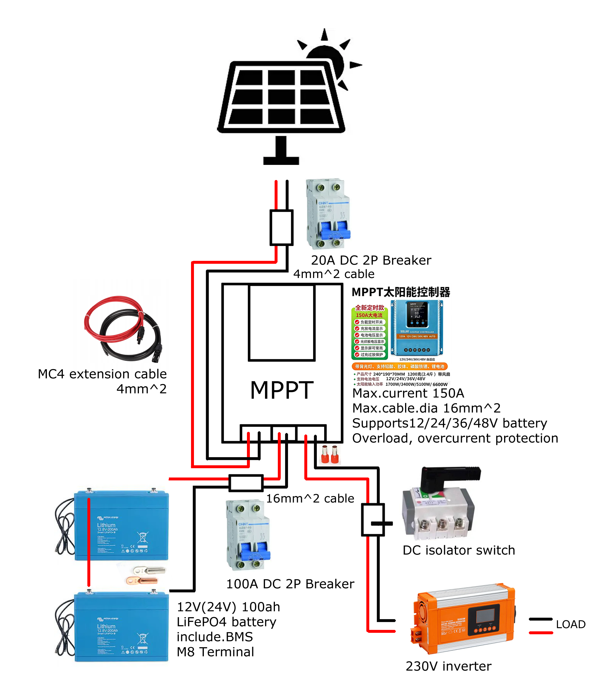

# Overview

This is a DIY project: a solar storage system built around low-power flexible panels. In its current form it exists to run LED lighting off-grid. If the system later expands, or needs to feed high-load household devices, the panels upgrade to fixed rooftop modules.

The interesting engineering problem here is a voltage-matching constraint: a battery can only be charged when the solar array's operating voltage sits comfortably above it, and that single rule decides almost everything downstream: panel configuration, battery voltage, controller choice. Everything in this design follows from that rule.

# Requirements

| Requirement    | Target                                                                                                         |
| -------------- | -------------------------------------------------------------------------------------------------------------- |
| Night lighting | LED, 50W × 8h = 400Wh per night                                                                                |
| Storage        | 2 × 12V 100Ah LiFePO₄ in series = 24V (~2.5kWh, expandable)                                                    |
| Solar          | 2 × 300W portable semi-flexible panels (low-power stage; rooftop panels are the future upgrade for high loads) |
| 230V backup    | 24V × 100A ≈ 2400W theoretical output (short-time capability, see §04)                                         |
| Sourcing       | Solar panels + battery locally; everything else cross-border                                                   |

# Design Process

## 01 Research: The Voltage-Matching Constraint

The core rule comes from MPPT charge controllers: they only start charging when the solar array voltage exceeds battery voltage +5V, and they need roughly battery +1V to keep charging. The chosen 300W semi-flexible camping panels run at 20Vmp, too low to charge a 24V battery on their own; in series they give 40Vmp / 50Voc, comfortably above any 12V or 24V threshold, and far under the controller's 100V ceiling even at −20°C.

The MPPT-to-battery connection uses 16mm² cable, limited by the MPPT's 16mm² maximum terminal size; ideally 25mm² would be used to leave proper safety margin.

On the market side: 12V packs dominate the Dutch camper/boat market, so the storage side settled on 2 × 12V 100Ah. Wiring rules, fuse placement and charge parameters were verified against Victron's manuals, the Wiring Unlimited guide and documented DIY builds.

## 02 System Architecture

The controller is a 6-port MPPT (PV / BAT / LOAD), which means the busbar is built into the controller: solar connects to the PV terminals, the battery reaches the BAT terminals through a 2P DC breaker, and loads hang directly off the LOAD terminals; no external busbar needed. At any instant the battery current equals load current minus solar current; the battery is the only bidirectional device, absorbing the surplus or covering the deficit automatically.

The two 12V batteries are wired in **series** for 24V: this keeps the inverter branch at a 100A-class current (24V × 100A = 2400W theoretical output). Paralleling at 12V would need 200A, beyond what the MPPT supports. Each battery carries its own built-in BMS.

## 03 Key Decisions

| Item       | Decision                                                        | Why                                                                                                              |
| ---------- | --------------------------------------------------------------- | ---------------------------------------------------------------------------------------------------------------- |
| Battery    | 2 × 12V 100Ah LiFePO₄ in series = 24V (100A BMS each, built-in) | Series keeps the inverter branch at 100A class (24V×100A=2400W); same model & batch; confirm BMS supports series |
| Panels     | 2 × 300W semi-flexible in series                                | Portable-first; series is mandatory for 20V panels; rooftop panels are the future upgrade                        |
| Controller | 6-port MPPT (PV / BAT / LOAD)                                   | Load output built in, the busbar lives inside the controller; BAT terminals take max 16mm²                       |
| Inverter   | Pure-sine inverter (24V input)                                  | 2400W theoretical, short-time                                                                                    |
| Protection | DC-only non-polarized breakers + isolator switch                | Breakers sized to cable ampacity; DC-rated only, AC breakers cannot quench DC arcs                               |

## 04 Efficiency Estimate: the 230V Chain

Every conversion stage takes a cut. Typical efficiencies at this power level:

| Stage                                 | Typical efficiency |
| ------------------------------------- | ------------------ |
| MPPT DC-DC conversion                 | 92–95%             |
| LiFePO₄ charge + discharge round trip | ~95%               |
| Pure-sine inverter DC→AC              | 88–93%             |

Multiplying the full chain (panel → battery → inverter → 230V):

**0.94 × 0.95 × 0.90 ≈ 80%**

Expect roughly **77–84% end-to-end** in practice (typically ~80%). For comparison, the LED path skips the inverter entirely (≈90% through MPPT + battery), which is why lighting runs directly on DC and 230V stays a reserve: every kWh pushed through the inverter chain leaves about a fifth behind.

## 05 Protection & Safety

- PV side: 20A 2P non-polarized DC breaker, doubling as a maintenance isolator; the MPPT-to-battery line runs through a 2P DC breaker (battery isolation). All breakers/switches must be DC-rated and non-polarized; AC breakers cannot quench DC arcs.
- LOAD branches: the LED hangs directly on the LOAD port (via a light/timer switch); the inverter branch runs through a DC isolator switch used for daily on/off, which also kills idle draw.
- Wiring standards: the MPPT uses the common green screw-clamp terminal blocks, paired with pin ferrules (no tinned wire ends, solder creeps); closed copper lugs onto M8 studs (no open lugs); hydraulic crimp; red/black discipline.
- Batteries in series: same model, same batch; confirm the BMS supports series connection; fully charge both before series wiring.
- Commissioning: polarity check before powering anything, battery first and PV second, charge parameters set per the LiFePO₄ 24V spec.

# BOM Overview

Sourcing strategy: the solar panels and the battery come from Dutch shops (warranty and shipping logic); everything else, MPPT, inverter, breakers, isolator, cables, terminals and accessories, comes from Taobao cross-border. Prices converted at €1 = ¥7.81. The full spec with the wiring list lives in the project folder; this is the condensed version.

| #   | Item                           | Spec                                              | Qty     | Est. price   | Source         |
| --- | ------------------------------ | ------------------------------------------------- | ------- | ------------ | -------------- |
| 1   | Solar panel                    | 300W semi-flexible, ETFE, MC4 leads               | 2       | €150–250/pc  | Local / Taobao |
| 2   | MPPT controller                | 6-port (PV/BAT/LOAD), BAT terminals max 16mm²     | 1       | ≈ €26.9      | Taobao         |
| 3   | Battery                        | 12V 100Ah LiFePO₄, built-in BMS, low-temp cut-off | 2       | €230–280/pc  | NL local       |
| 4   | Inverter                       | Pure-sine, 24V input, ≥2000W                      | 1       | €102–192     | Taobao         |
| 5   | DC breaker (PV side)           | 20A 2P, non-polarized, ≥250V DC                   | 1       | €3.8–10.2    | Taobao         |
| 6   | DC breaker (MPPT–battery line) | 100A 2P, non-polarized                            | 1       | €5.1–12.8    | Taobao         |
| 7   | DC isolator (inverter branch)  | 100–125A 2P, non-polarized                        | 1       | €7.7–19.2    | Taobao         |
| 8   | PV extension cable             | MC4 connectors, 1–2m male/female                  | 2–4     | €1.3–3.8     | Taobao         |
| 9   | DC cable                       | Pure copper, 2-core 16mm², 5m total               | 1       | ≈ €20.1      | Taobao         |
| 10  | Small-load cable               | 2.5mm² red + black                                | 3m each | €0.3–0.5/m   | Taobao         |
| 11  | Pin ferrules                   | Copper VE16-18, 16mm²                             | 100 pcs | ≈ €1.3       | Taobao         |
| 12  | Copper lugs                    | SC16-8, closed type, M8                           | 20 pcs  | ≈ €3.1       | Taobao         |
| 13  | Crimping tool                  | Hydraulic lug crimper, 4–120mm²                   | 1       | ≈ €21.5      | Taobao         |
| 14  | Accessories pack               | WAGO 221 connectors, heat shrink, zip ties, tape  | 1 pack  | €2.6–5.1     | Taobao         |
| 15  | Battery case                   | EVA hard case (fits 100Ah)                        | 2       | €3.8–10.2/pc | Taobao         |

Budget ≈ €1000–1400 all-in. Build phases: (1) order long-lead parts, (2) DC stage: panel, breaker, MPPT, batteries, LED, (3) inverter + isolator, (4) winter field tests, (5) documentation and demo.

# Current Status

Done: requirements, architecture, protection scheme, BOM draft. Next: procurement and build. The project documentation is maintained alongside this page and updated as the build progresses.

# References

1. [Victron Wiring Unlimited](https://www.victronenergy.com/upload/documents/The_Wiring_Unlimited_book/43562-Wiring_Unlimited-pdf-en.pdf)
2. [DIY Solar Forum: battery wiring review](https://diysolarforum.com/threads/is-this-battery-diagram-ok-24v-400amps.8488/)
3. [Victron SmartSolar MPPT manual (sizing rules)](https://www.manualslib.com/guide/3713518/victron-energy-smartsolar-mppt-100-30-smartsolar-mppt-100-50-manual.html)
