# Background

Inland vessels can no longer run diesel generators while moored alongside; they have to plug into shore power. A ship's demand is large and swings hard, peaking around 3×250A. The quay can only supply 3×80A, which is more than three times short.

This was a project from Hogeschool Rotterdam, working with Endenburg as the client. Five of us: my design partner and I as the two Industrial Product Design students, and three Electrical Engineering students on the electrical verification and deliverables. My partner and I had already built a complete cargo box for a painter's bakfiets together during our internship at ZOEM Bike, so we kept the same division of labour. I took the research, the material analysis, writing the conclusions up as design decisions, and the documentation, visuals and final presentation; my partner mainly did the 3D modelling, the renders and the technical drawings.

# Design brief

The job on the physical side was a modular cabinet that can carry a 3×250A peak off a 3×80A grid connection and grow along with the demand.

The project set five critical success factors, and every design decision afterwards had to answer to them:

| Critical success factor | What it asks for |
| --- | --- |
| Safety and compliance | Meets the relevant electrical and maritime standards |
| Electrical capacity | Reliable output from a limited input |
| Weather resistance | Corrosion resistance, IP rating and fasteners suited to a port environment |
| Usability and easy maintenance | Components easy to reach, replaceable modules, clear diagnostics |
| Modularity | Has to be expandable for future changes |

# Research and ideation

Standards

Existing cabinets

Cabinet construction

Possible solutions

Expandability research

<h4>Standards</h4>
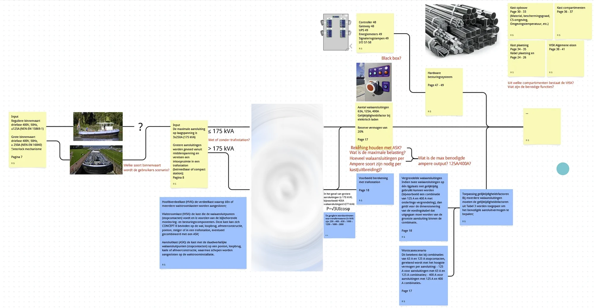

The constraints and judgement calls came out of the relevant technical documents. The IP ratings, the coating system, the earth resistance, the mounting height and the component configuration are all extracted from there.

<h4>Existing cabinets</h4>
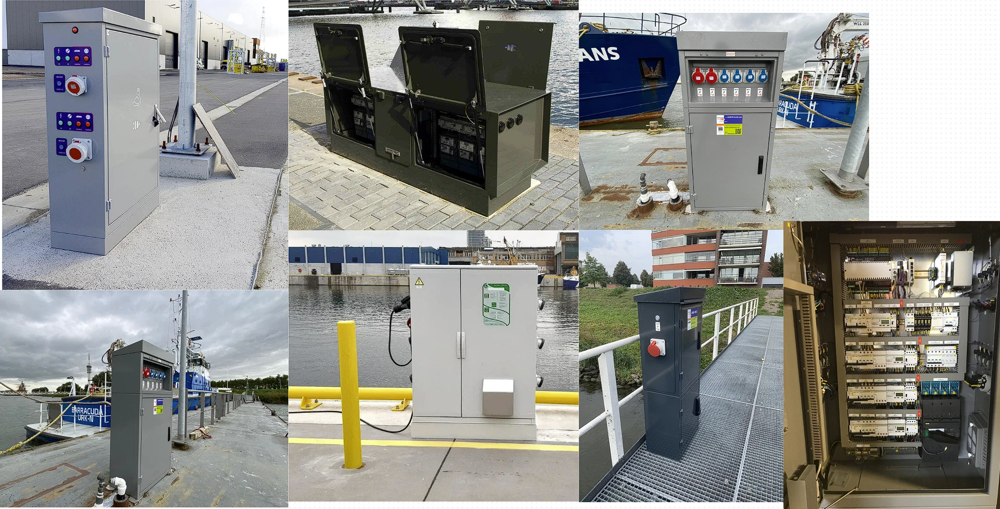

We started by laying out the shore power cabinets already in service, looking at how they arrange their connections, how they handle protection and what the operating interface looks like. This step sorted the approaches the industry has already proven from the ones we would have to try ourselves.

<h4>Cabinet construction</h4>

The cabinet breaks into four layers, inside out:

<ul>
<li><strong>Enclosure</strong>: frame, profiles, ribs, gaskets, door, three-point lock, hinges, power sockets</li>
<li><strong>Protection</strong>: corrosion, mechanical impact, IP rating, earthing, ventilation</li>
<li><strong>Electronics</strong>: transformer, inverter, microcontroller, sensors, BMS, batteries, RFID, LEDs</li>
<li><strong>Expansion bays</strong>: held back for modular growth</li>
</ul>

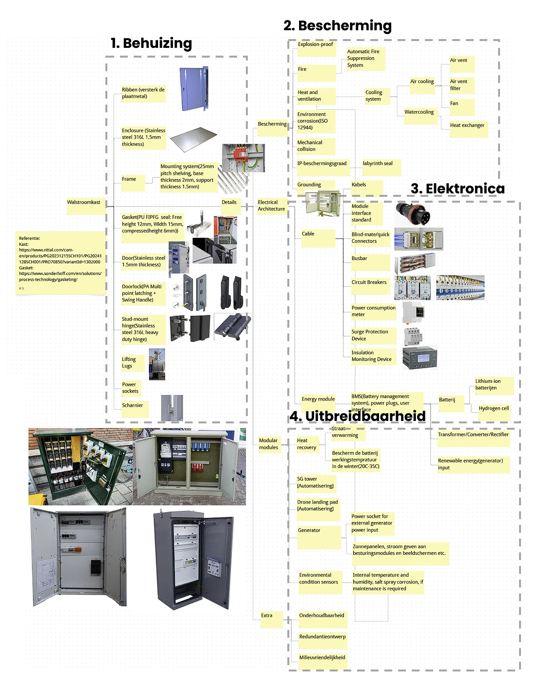

<h4>Possible solutions</h4>
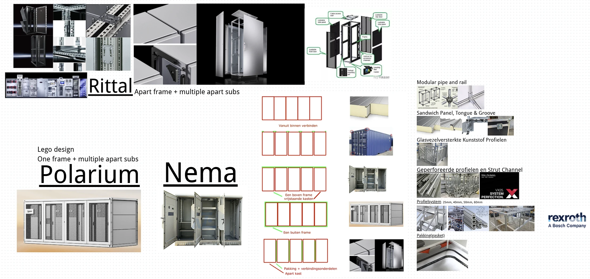

We listed the technical and structural routes that could work and went through them one by one: which ones are buildable at this size and in this environment, and which ones fall over on cost or lead time.

<h4>Expandability research</h4>
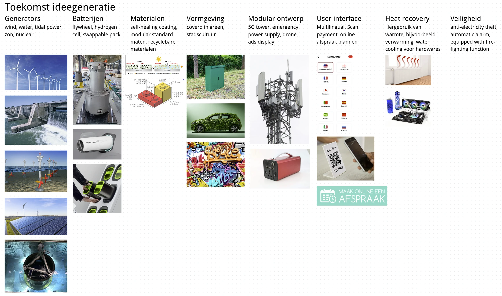

This looked at the directions the cabinet could grow in later: capacity, appearance, and functions bolted on top.

We went through the standards documentation first, then analysed the shore power products already in service, then mapped the possible user scenarios and the variables inside them. Four variables drive the configuration:

1. **Power**: the required kVA decides the configuration.
2. **Supply**: coupled straight to a transformer, or straight onto the grid.
3. **Vessel**: small and large cargo ships need different amounts of power.
4. **Interfaces**: the connection types and amperage on the cabinet follow from the scenarios above.

## Materials and assembly research

Frame options

Connections

Expandability options

<h4>Frame options</h4>
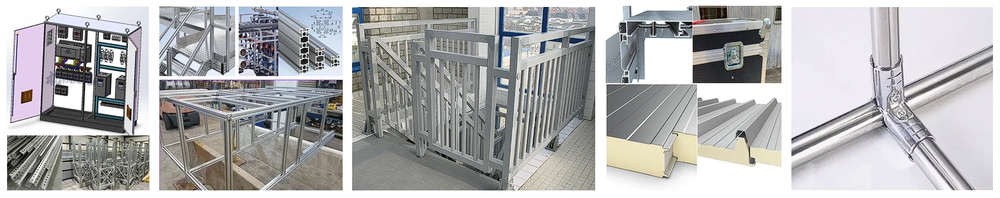
<table class="mat-table">
<thead><tr><th>Option</th><th>Advantages</th><th>Disadvantages</th></tr></thead>
<tbody>
<tr><td>Perforated profiles / Strut Channel (25mm pitch)</td><td>+flexible component placement +modular expansion +standard parts, easy to source</td><td>−sealing is awkward</td></tr>
<tr><td>Profile system</td><td>+high stiffness and mechanical strength +standard parts, easy to source +modular expansion</td><td>−limited sealing</td></tr>
<tr><td>Glass fibre reinforced plastic profiles</td><td>—</td><td>−short service life −questionable reliability in the operating environment</td></tr>
<tr><td>Tongue-and-groove sandwich panel</td><td>—</td><td>−limited expandability −insufficient sealing</td></tr>
<tr><td>Modular pipe and rail</td><td>—</td><td>−too many connection points −insufficient sealing</td></tr>
<tr class="verdict"><td colspan="3"><strong>Chosen:</strong> perforated strut channel on a 25mm pitch, with a side gasket and a roof cap for the sealing.</td></tr>
</tbody>
</table>

<h4>Connections</h4>
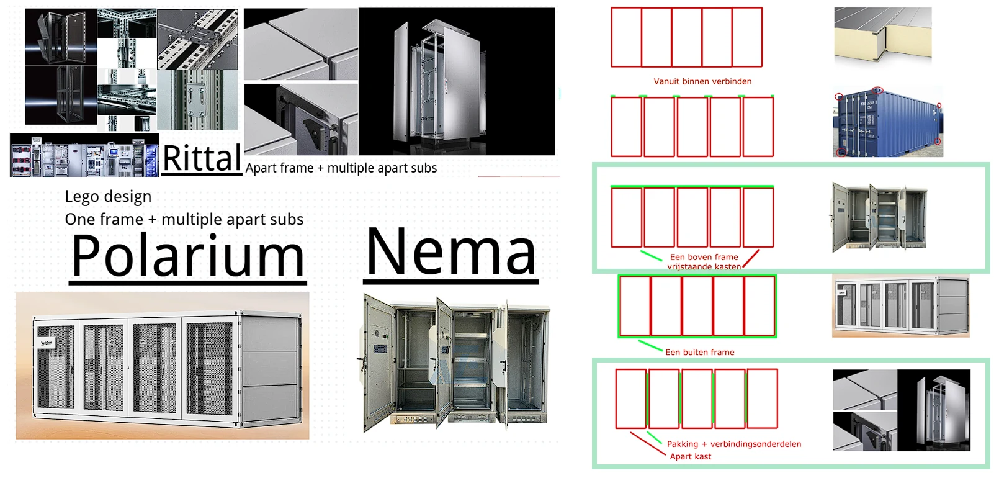

The modules are clamped between a top and a bottom layer, and the individual cabinet modules bolt together left and right. So adding a module means a new top and bottom layer for it: the lower layer has to carry the weight, and the upper layer, in effect the roof, has to stay watertight.

<strong>Chosen:</strong> clamping between a top and a bottom layer, with the modules connected laterally. Keeping the shell continuous seals better than a fully modular panel build.

<h4>Expandability options</h4>
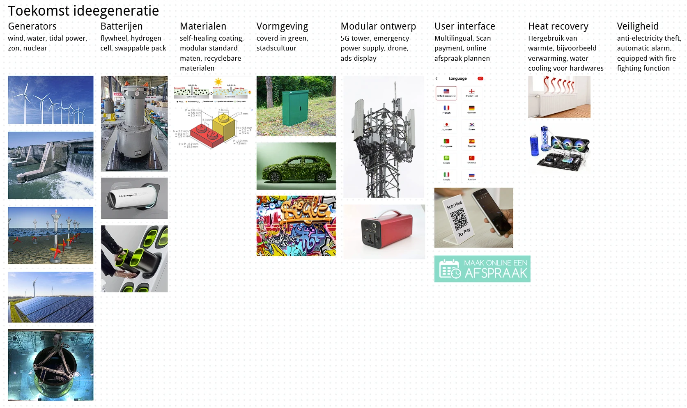

<strong>Batteries</strong>: an internal battery pack absorbs current peaks and large power demand; a separate external input takes emergency power or a generator.

<strong>Form</strong>: in the city, a natural treatment (planting bed, muted colours) so it blends into its surroundings; in a port environment, keep the functional industrial character.

<strong>Modular</strong>: a 5G tower for future drones and autonomous vehicles in the port; an emergency supply point for charging small devices like phones.

<strong>Chosen:</strong> all three directions, batteries, form and modularity.

## Concept directions

Concept exploration

Design concept

Final concept

<h4>Concept exploration</h4>
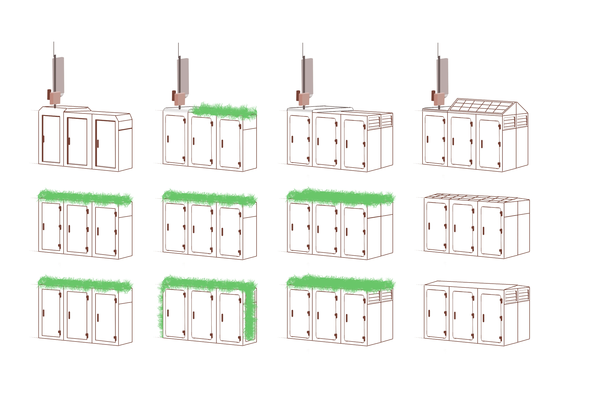

This round spread out twelve different concepts, across cabinet silhouette, module division, connection layout and formal language, to lay the possibilities out flat and compare them.

<h4>Design concept</h4>
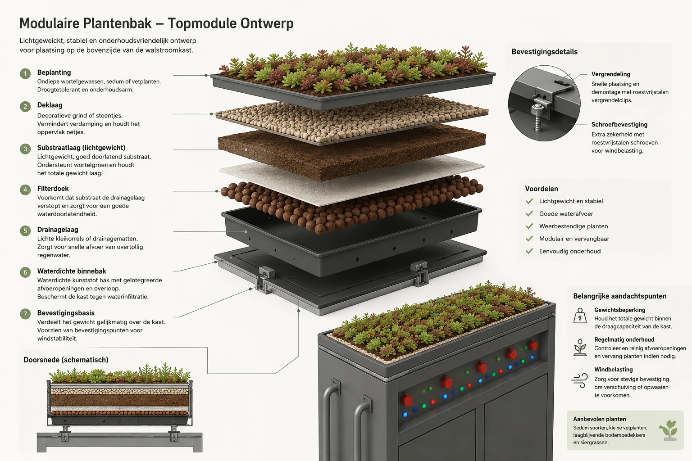

The roof becomes a planting bed (sedumdak) to soften the cabinet's visual character in a public urban setting.

<strong>Structure:</strong> on the roof only, no extension to the sides, a rectangular planter. The module itself has to be recognisable, replaceable and easy to service.

<strong>Plant requirements:</strong> sun-tolerant, wind-resistant, drought-tolerant, shallow-rooted, low maintenance.

The plants bring a natural note into the design and soften the industrial look, so the cabinet sits more comfortably in urban public space.

<strong>Image credit:</strong> this image is <strong>AI generated</strong>. It is a concept illustration, not a photo of the built result.

<h4>Final concept</h4>
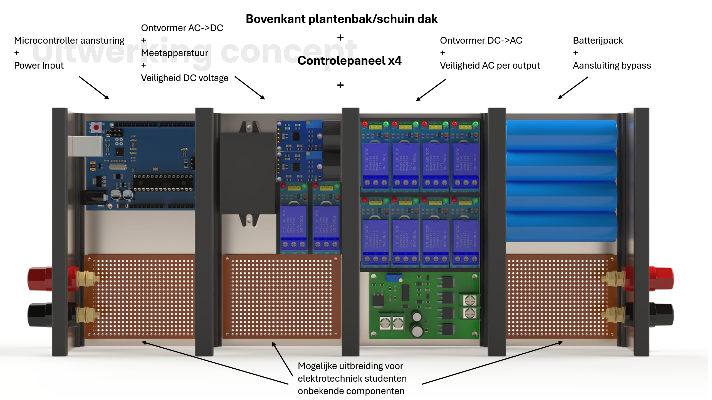

This is the direction we narrowed down to, drawn out as a full cabinet: four module columns, control, power, metering and the AC/DC conversion at the top, then the safety devices, the control panels and the DC/AC inverter section below.

# Solution

## Current buffering

Mains power comes in through the limited grid connection and is rectified to DC to charge the battery pack. The batteries cover the ship's peaks, and the DC is inverted back to the AC the vessel needs. Current metering, protection and monitoring sit in between, and anything to do with certification and billing follows the port's actual standards.

## Modular structure

The cabinet is divided into four columns, one module each. The top holds control, power, metering and the AC/DC conversion; below that come the safety devices, the control panels and the DC/AC inverter section.

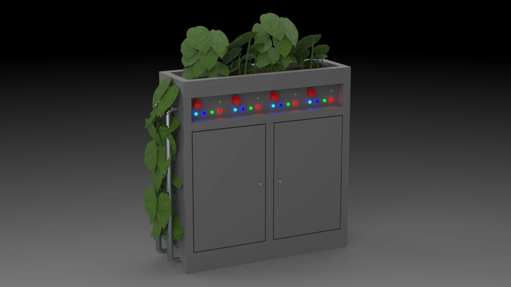
Module A

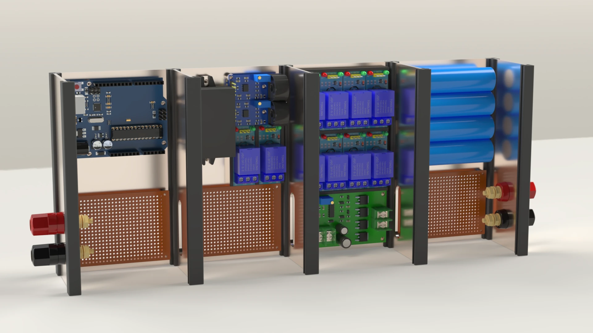
Scale model; overall

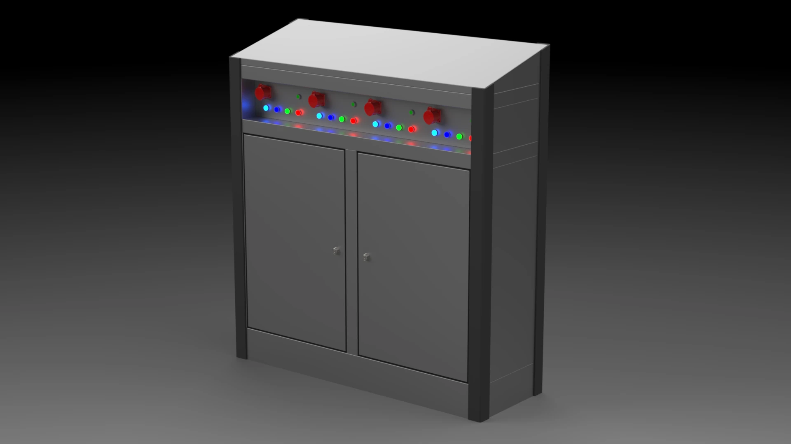
Module B

The scale model follows the real layout: all the electronics mounted in a 3D-printed frame, with module A as the upper section holding the hardware and controls and module B as the lower section kept open for later expansion. It is there to show the zoning and the structural logic of the full-size cabinet.

The roof doubles as a planting bed, purely to soften how industrial the cabinet looks in a public urban setting. The modules are replaceable and easy to service, and do not extend sideways. The plants had to be sun-tolerant, wind-resistant, drought-tolerant, shallow-rooted and low-maintenance.

## Materials and protection

| Item | Choice |
| --- | --- |
| Enclosure | Stainless steel AISI 316L sheet, ≥ 2mm thick, welded |
| Protection | IP54 outside, IP20 inside; IK10 impact resistance |
| Coating | At least 2 coats inside and out, dry film ≥ 120 µm, rated for C5 environments, service life > 15 years |
| Locking | Three-point lock |
| Earthing | Earth resistance ≤ 1 Ω; doors and metal parts bonded to the enclosure with a flexible earth conductor |
| Ambient temperature | −25 °C to +40 °C |
| Siting | Always above the locally applicable high-water level; on pontoons or jetties the cabinet needs a raised base and every cable entry has to be sealed watertight |

The materials were compared in two blocks: the sheet metal grade for the enclosure, and the material for the structural profiles.

Enclosure sheet

Structural profiles

<h4>Enclosure sheet</h4>
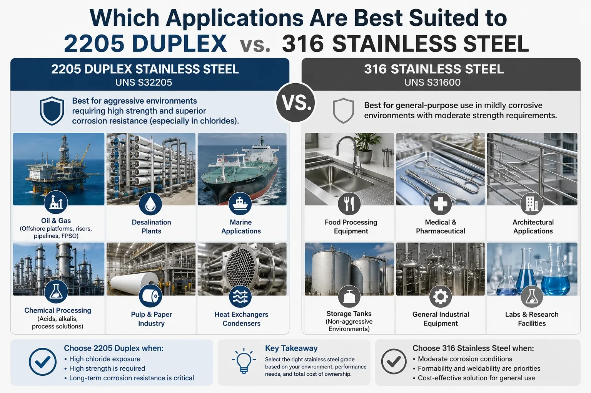
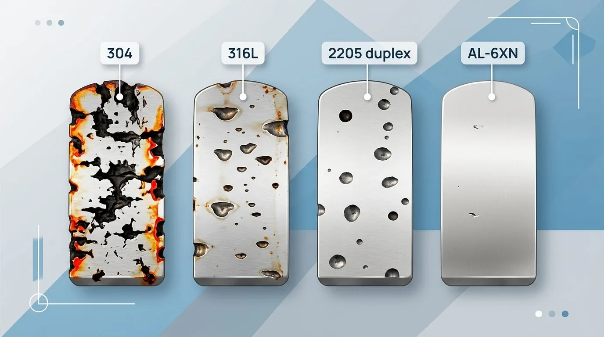
<table class="mat-table">
<thead><tr><th>Grade</th><th>Advantages</th><th>Disadvantages</th></tr></thead>
<tbody>
<tr><td>316 (sheet metal + welding)</td><td>+molybdenum added, good resistance to chloride environments</td><td>−hard to machine −poor welding, cleaning or passivation quality still causes local corrosion −less chloride resistance than 316L</td></tr>
<tr><td>316L (sheet metal + welding)</td><td>+lower carbon content than 316 for better corrosion resistance +relatively easier to weld +good resistance to chloride environments</td><td>−hard to machine −poor welding and cleaning quality still causes local corrosion −costs more than 316</td></tr>
<tr><td>2205 duplex (sheet metal + welding)</td><td>+stronger than 316L +excellent resistance to chloride environments +suited to chloride concentrations above 1000 ppm or temperatures above 60 °C +balanced ferrite and austenite fractions</td><td>−harder to machine than austenitic stainless such as 316</td></tr>
<tr class="verdict"><td colspan="3"><strong>Chosen:</strong> 316L. The port environment is high in chlorides, and 2205’s extra headroom comes with a price and machining penalty we could not justify.</td></tr>
</tbody>
</table> van roestvrij staal 304 versus 316 · Gids (2026) ／ AISI 316 vs 316L Stainless Steel, Difference of SS316 &amp; SS316L Properties Composition Yield Strength Density ／ Duplex roestvrij staal 2205 - Eigenschappen, Toepassingen &amp; Voordelen - LangHe Industry Co., Ltd. ／ 2205 Duplex vs. 316 Stainless Steel: Strength, Corrosion Guide - MWalloys ／ flashcards AK hoofdstuk 4 | Quizlet

<h4>Structural profiles</h4>
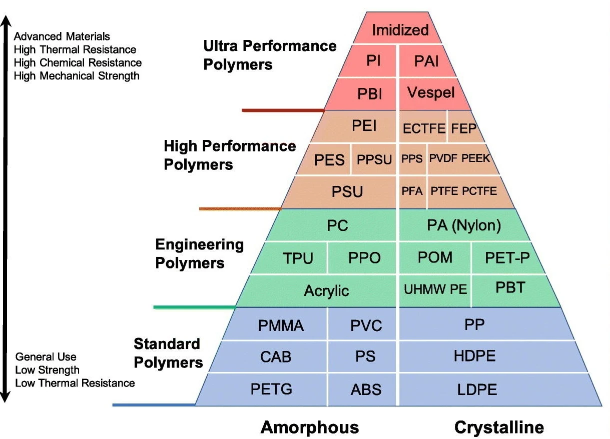
<table class="mat-table">
<thead><tr><th>Material</th><th>Advantages</th><th>Disadvantages</th></tr></thead>
<tbody>
<tr><td>HDPE (with UV stabilisers; extrusion/injection moulding)</td><td>+good corrosion resistance +high impact resistance +cheap and easy to produce +recyclable</td><td>−only moderate UV stability −low stiffness, so it cannot act as a structural profile −creeps and deforms under sustained load −high thermal expansion</td></tr>
<tr><td>ASA (extrusion/injection moulding)</td><td>+good corrosion resistance +good UV stability +better suited to long-term outdoor use than HDPE +good dimensional stability and better heat resistance than HDPE</td><td>−low stiffness, so it cannot carry load −more expensive than HDPE</td></tr>
<tr><td>GFRP (glass fibre reinforced polymer; pultrusion)</td><td>+good UV stability and corrosion resistance +high stiffness, so it works as a structural profile +long service life</td><td>−more expensive than HDPE and ASA −harder to produce</td></tr>
<tr class="verdict"><td colspan="3"><strong>Chosen:</strong> GFRP pultrusion. HDPE stays behind on long-term UV and creep even with a UV stabiliser, and ASA is not stiff enough to carry the structure. GFRP wins on weathering, corrosion resistance, tensile strength and long-term structural stability.</td></tr>
</tbody>
</table>: UV Stability &amp; Weather Resistance in Upcycled Projects ／ ABS &amp; ASA Extrusions - Condale Plastics ／ Glass Fiber Reinforced Polymer (GFRP) | Definition, Advantage ／ HDPE vs FRP Pipe：Strength, Lifespan, Density Comparative ／ Marine Application of Fiber Reinforced Composites: A Review

# Building it

  

    
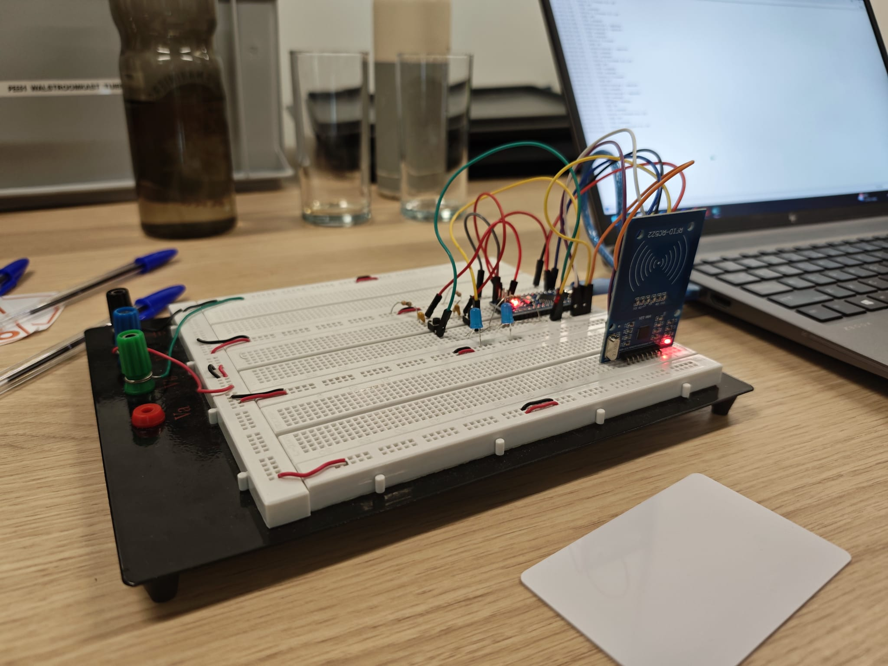Step 1: RFID authorisation prototype

    
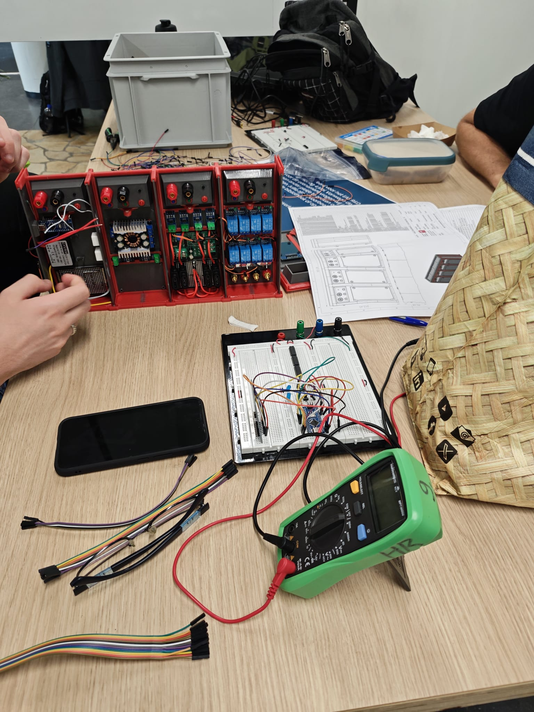Step 2: Wiring and testing

    
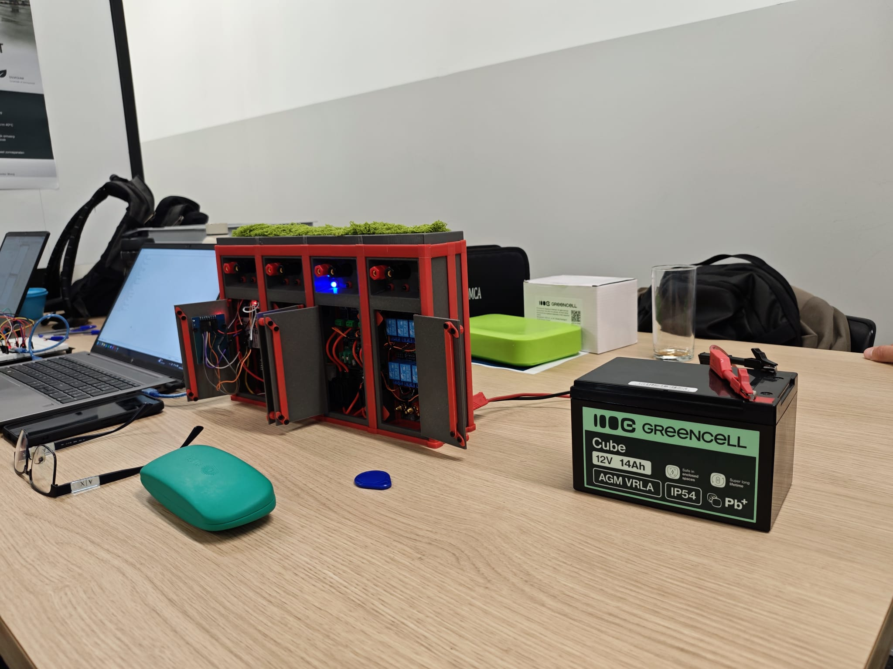Step 3: Scale model assembly

    
Step 1: RFID authorisation prototype

    
Step 2: Wiring and testing

    
Step 3: Scale model assembly

    
Step 1: RFID authorisation prototype

    
Step 2: Wiring and testing

    
Step 3: Scale model assembly

  

We got the RFID reader and the authorisation logic running on a breadboard first, then wired the cabinet and checked voltages and circuits point by point with a multimeter, and finally assembled the scale model to the drawings: real components wired into the zones they occupy in the full-size cabinet, powered up and debugged for the final defence.

# Technical drawings

  
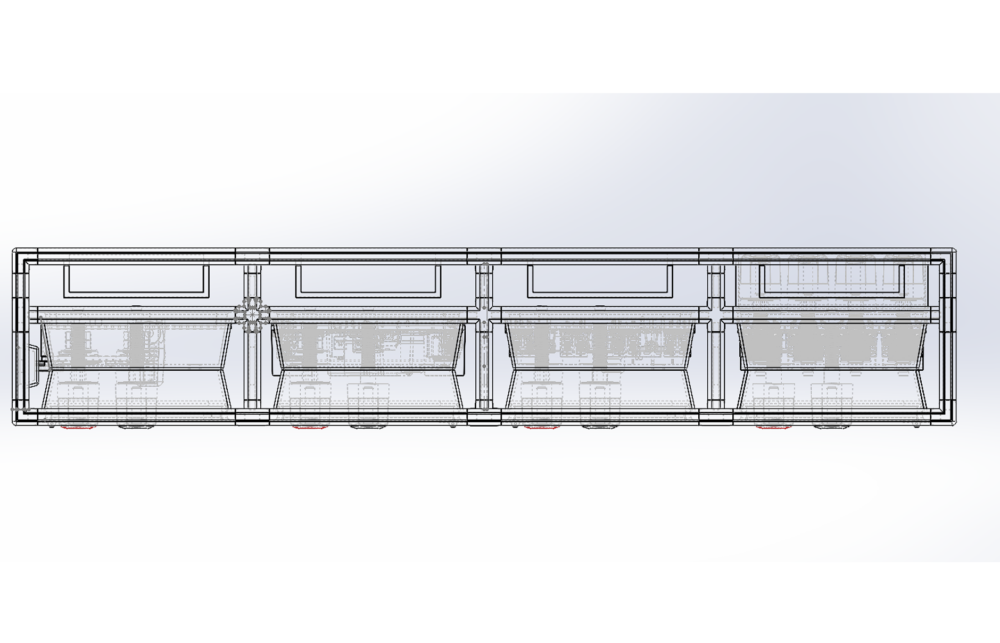
Top view

  
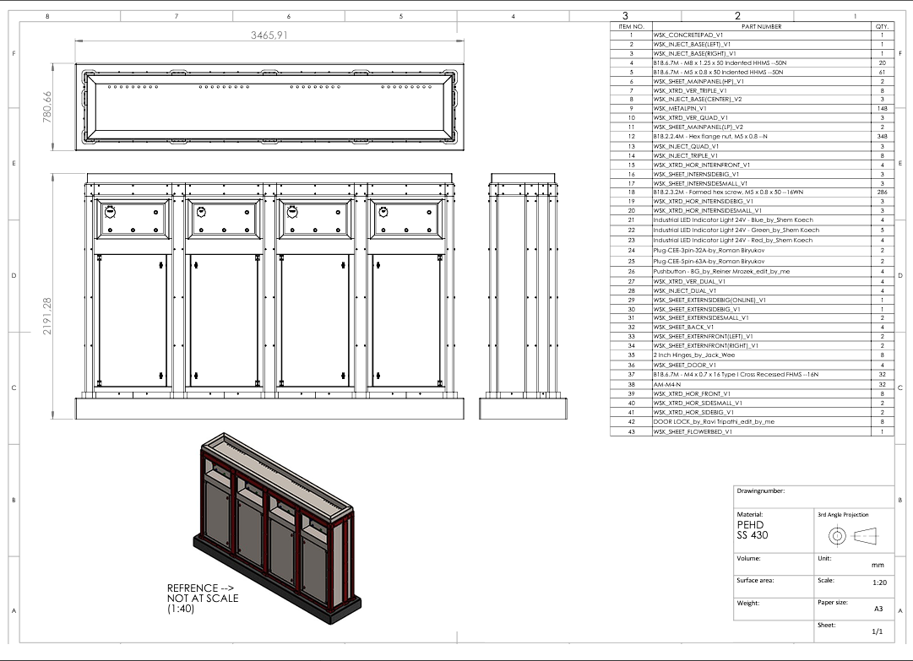
General assembly

  
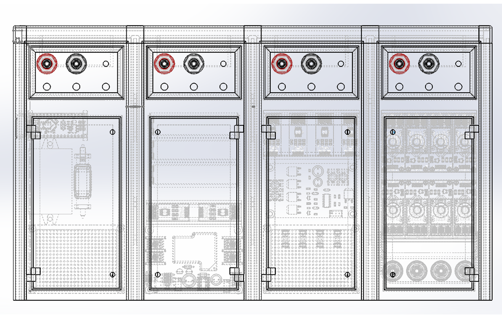
Front view

  
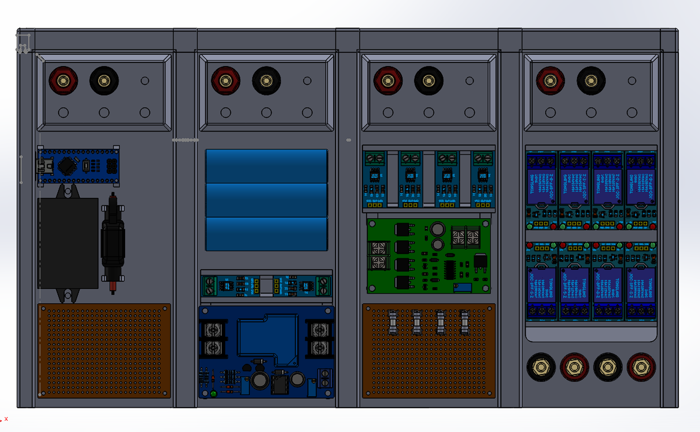
Internal layout

# Future expandability

The modularity is a door left open. The central unit handles control and connections; when more capacity is needed, an identically shaped battery unit clips onto the side. Further down the line the same frame can carry heat recovery, a 5G tower, a drone landing platform or an external power input. On top, the standard green roof can be swapped for solar panels to power the displays and sensors on the cabinet.

# The real thing

  

    
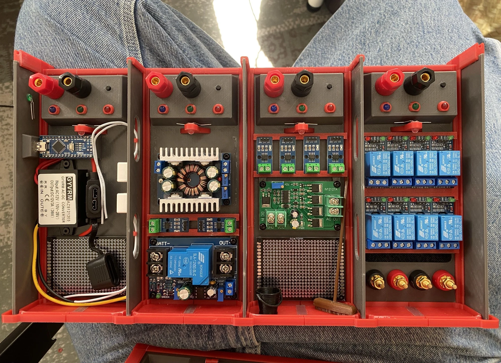Front view

    
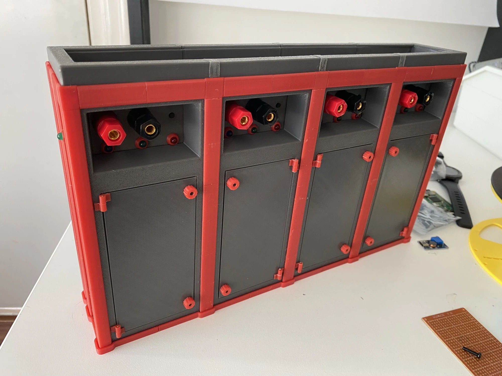Side view

    
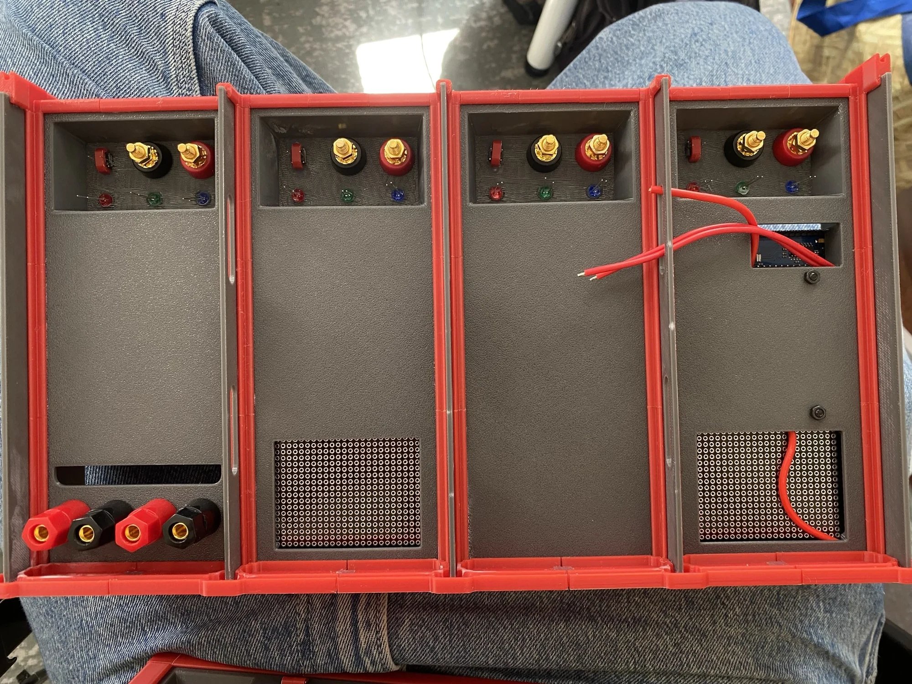Back view

    
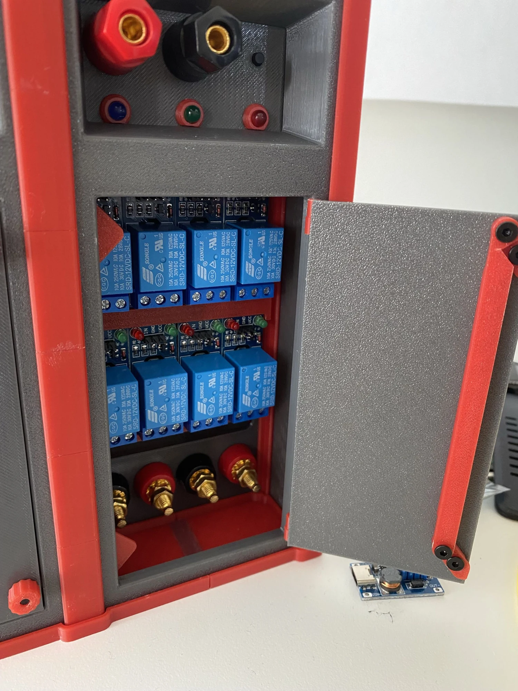Door open (1)

    
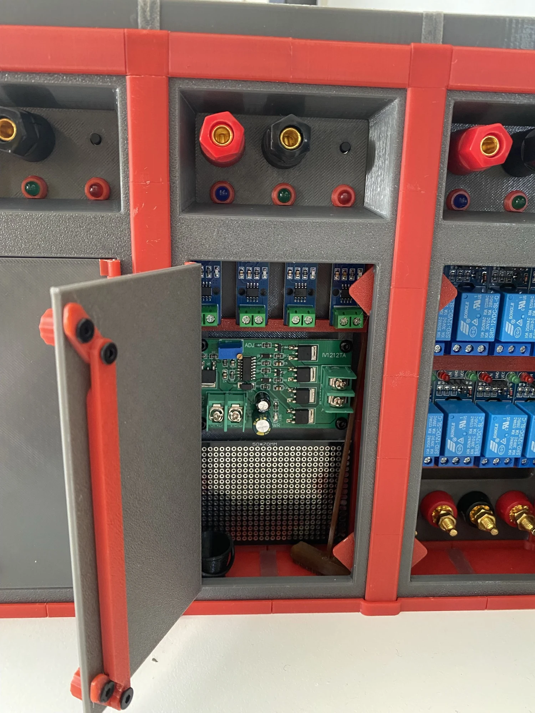Door open (2)

    
Front view

    
Side view

    
Back view

    
Door open (1)

    
Door open (2)

    
Front view

    
Side view

    
Back view

    
Door open (1)

    
Door open (2)

  

# Delivery and collaboration

The handover was a scale model (all the electronics mounted in their real positions in a 3D-printed frame), the full SolidWorks model, technical drawings and the documentation, used to demonstrate the cabinet's zoning logic and structure.

The project never quite lined up with what the client expected. The first few weeks went into waiting for additional information and user scenarios from them; once it became clear that they wanted an electrical calculation and that this kind of assignment sits outside industrial design, the two directions had already drifted apart. After talking to both coaches we reshaped the project into our own design brief: a modular, expandable shore power cabinet. That turned out to be the right call, and it is where the project finally lined up with our learning goals.

# What this project taught me

- <strong style="color:var(--accent)">Material research only counts when it lands as a decision</strong>: comparing 316, 316L and 2205 duplex stainless, weighing HDPE against GFRP, all of it has to end in "so we pick this one". The research is not the hard part; collapsing it into a choice that can be questioned is.
- <strong style="color:var(--accent)">Electrical standards are design input, not background reading</strong>: IP ratings, IK10, C5 coating, 1 Ω earthing, mounting height. These fixed how the cabinet could look.
- <strong style="color:var(--accent)">When information does not arrive, decide anyway</strong>: the most expensive lesson here. The client's direction stayed unclear and we waited too long. Next time I set a deadline for the essential information and reroute or rewrite the brief when it passes.
- <strong style="color:var(--accent)">Cross-discipline work runs on asking the right questions</strong>: I could follow the electrical students' reasoning because I had taught myself the fundamentals, enough to ask about heat build-up, transformer efficiency and power supply selection.
- <strong style="color:var(--accent)">I want to be a hybrid designer</strong>: this project pushed me a step away from styling and concepts and toward the technical side. I want to keep building on electrical safety, embedded systems and basic electronics.

## Sources

### Materials and structure

**Enclosure sheet**

1. [Identificatie van roestvrij staal 304 versus 316 · Gids (2026)](https://oceanplayer.com/nl/304-vs-316-stainless-steel-identification-guide-2026/)
2. [AISI 316 vs 316L Stainless Steel, Difference of SS316 & SS316L Properties Composition Yield Strength Density](https://www.theworldmaterial.com/difference-ss316-vs-ss316l-stainless-steel/)
3. [Duplex roestvrij staal 2205 - Eigenschappen, Toepassingen & Voordelen - LangHe Industry Co., Ltd.](https://langhe-industry.com/nl/duplex-stainless-steel-2205/)

**Structural profiles**

1. [ABS & ASA Extrusions - Condale Plastics](https://www.condaleplastics.com/materials/material-selection/abs-asa-extrusions/)
2. [Glass Fiber Reinforced Polymer (GFRP) | Definition, Advantage](https://petronthermoplast.com/everything-you-need-to-know-about-glass-fiber-reinforced-polymer-gfrp/)
3. [HDPE vs FRP Pipe：Strength, Lifespan, Density Comparative](https://www.ganglongfiberglass.com/hdpe-vs-frp-pipe/#UV_Resistance)

### Planting bed (green roof)

1. [10 tips: ik wil een sedumdak en nu? – SedumSpecialist](https://www.sedumspecialist.nl/blog/10-tips-ik-wil-een-sedumdak-en-nu/)
2. [Sedum mix voor groendak in de zon: 15 soorten – Groenpalet Shop](https://groenpalet-shop.be/shop/sedums/inpot/sedum-mix-groendak-zon-15-soorten/)
3. [Sedumdak voor- en nadelen: een eerlijk overzicht - GROEN Dichterbij](https://www.groendichterbij.nl/sedumdak-voor-en-nadelen/)
